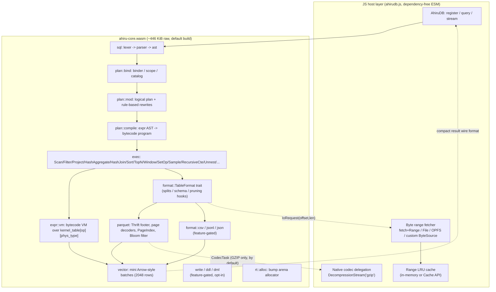

# ahirudb Design Document

A lightweight SQL engine, built to run in under 1 MiB of WASM, that queries
Parquet directly.

*Last revised against the implementation on 2026-08-13. Where this document
describes intent rather than a shipped fact, it says so explicitly.*

---

## 1. Goals and premises

### Goals

| # | Requirement | Target |
|---|---|---|
| G1 | WASM binary size | **raw ≤ 1 MiB** (gzip ≈ 200 KB) — **met**, see §3 |
| G2 | Read Parquet as a table | Local file / HTTP Range / OPFS |
| G3 | Query it with SQL | A large, practically-DuckDB-shaped subset (§7) |
| G4 | Extend to other formats | CSV / TSV / JSONL / single-document JSON, feature-gated (§5) |

### Premises (explicit assumptions)

- **1 MiB means the raw `.wasm` alone.** A module fetched lazily at runtime
  (`ahiru-zstd`, used only in the opt-out configuration where the `zstd`
  feature is disabled) is counted separately. ZSTD turned out to cost only
  about 13 KB, so by default it is linked directly into the core (inside the
  1 MiB budget) rather than split out — see §6.
- The primary target is the **browser**. The same binary also runs under
  Node, Deno, and Cloudflare Workers.
- **Read-only by default.** Parquet/CSV/JSONL/JSON tables backed by a
  `Source` are immutable. Writing (`ddl`/`dml`/`export`) exists as an
  explicitly opt-in, separately-gated layer that only ever touches in-memory
  tables created through it — see §16. This premise, not "no writes at all,"
  is what actually held as the engine grew.
- Single-threaded. No dependency on `SharedArrayBuffer` (COOP/COEP).
  Table data is not fully materialized in memory — the design assumes
  **only the needed columns and needed pages are ever fetched**.

### Non-goals

Durable/persistent catalogs, multi-statement transactions, distributed
execution, and spilling to disk (every blocking operator — hash aggregate,
hash join, sort, DISTINCT ON, sampling, recursive CTEs — has a fixed
in-memory byte cap and returns `Oom` rather than spilling; see §9 and §15).

Note that two items that were originally non-goals for v1 — window
functions and nested Parquet types — are **not** non-goals anymore; both
shipped (§7, §5).

### Why not an existing engine

| Candidate | Size | Verdict |
|---|---|---|
| duckdb-wasm | Tens of MB (~10 MB even after brotli) | An order of magnitude over the size requirement |
| sql.js (SQLite) | ~1.5 MB, no Parquet, row-oriented | Fails G2 |
| hyparquet (JS) | Small, but a Parquet reader only, no SQL | Fails G3 |
| Arquero / DataFusion-wasm | No SQL / several MB+ | Not viable |

→ **Build a purpose-built engine.** The 1 MiB budget isn't reached by
shrinking DuckDB; it's reached by choosing, from the start, what gets built
at all.

---

## 2. Overall architecture



The design rests on three pillars:

1. **Never read a byte that isn't needed** (projection pushdown + multi-level
   statistics pruning: RowGroup min/max, PageIndex, Bloom filters — now also
   covering `IN` lists, not just equality/range; see §17). Data can be much
   bigger than the engine; this is what makes that tractable.
2. **Handle async I/O without Asyncify** (§6). Asyncify roughly doubles
   generated code size, which is incompatible with the size budget.
3. **Let the host do what the host is good at** (gzip inflate, range
   caching, error-message formatting). Keep the wasm budget for the engine
   itself.

---

## 3. Size budget

### Measured (2026-08-13, via `./scripts/size.sh`, `wasm-opt -Oz` applied)

| Configuration | raw | gzip -9 | of 1 MiB budget |
|---|---:|---:|---:|
| Parquet only, ZSTD off | 467,319 B | 204,626 B | 44.6% |
| + CSV | 491,713 B | 214,882 B | 46.9% |
| + JSONL | 501,478 B | 218,506 B | 47.8% |
| + CSV + JSONL (all read formats) | 510,581 B | 222,953 B | **48.7%** |
| Parquet only, **default build** (ZSTD on) | 481,241 B | 210,142 B | 45.9% |
| `ahiru-zstd.wasm` standalone (opt-out fallback) | 12,668 B | 6,621 B | separate budget |

The CI size gate (`size` job in `.github/workflows/ci.yml`) judges the
**fully-loaded configuration** (all read formats on) against the 1 MiB raw
ceiling, not a trimmed distribution — a gate that only a minimal build could
pass wouldn't actually protect anyone shipping the full feature set.
`ddl`/`dml`/`export` (§16) are opt-in and off in these measurements, matching
what a read-only distribution actually ships; turning them on is a separate,
deliberate size trade a consumer makes.

At 48.7% of budget with the entire current SQL surface (§7) — aggregation,
joins, window functions, CTEs including `WITH RECURSIVE`, subqueries, JSON,
regex, `PIVOT`/`UNPIVOT`, lambda expressions, DDL/DML, and more, all
included — there is still comfortable headroom. The original per-subsystem
size estimate this document used to carry (a 750 KB build-up across parser,
binder, expression VM, etc.) turned out to be a significant overestimate in
every category; `no_std`'s elimination of `core::fmt`, hand-written Thrift
decoding instead of a generic runtime, and the physical-type-6 kernel table
(§8, §11) did more than expected. That estimate has been dropped from this
document in favor of just tracking the real number, which `./scripts/size.sh`
reports on every run and CI gates on every PR.

---

## 4. Language and build configuration

**Rust + `no_std` + `alloc`.**

Rationale: writing a parser over adversarial input (Parquet bytes, SQL text)
safely, plus the existing testing/fuzzing ecosystem, outweighs the modest
size edge C/Zig would offer. But idiomatic Rust defaults are size-hostile, so
the following is enforced:

```toml
# Cargo.toml
[profile.wasm]
inherits = "release"
opt-level = "z"
lto = "fat"
codegen-units = 1
panic = "abort"
strip = true

# build: cargo build --profile wasm --target wasm32-unknown-unknown \
#          -p ahiru-core --no-default-features [--features csv,jsonl,zstd]
```

This builds on **stable Rust** (CI pins `dtolnay/rust-toolchain@stable`).
Earlier plans in this document called for `-Z build-std` on nightly to
recompile `core`/`alloc` themselves for extra size savings; in practice that
wasn't needed to hit the 1 MiB budget, and avoiding a nightly toolchain
dependency was judged more valuable than the marginal size it might have
bought. There is no `.cargo/config.toml` unstable-flags file in this repo.

**The main reason for `no_std` is eliminating `core::fmt`.** Using `format!`
/ `Debug` / `Display` anywhere pulls in the formatting machinery, which alone
costs 30–60 KB. Errors are carried as numeric codes (`error.rs`); string
rendering happens in the JS host, from a lookup table (§10). `Debug` impls
that do exist in the codebase are gated behind the `std` feature
(`#[cfg_attr(feature = "std", derive(Debug))]`) so they never reach the wasm
build.

`std::collections::HashMap` (SipHash, a fairly large implementation) is not
used either — the engine already needs its own open-addressing table for
aggregation (§9), so that's the only hash table in the codebase.

Post-build: `wasm-opt -Oz --strip-debug --strip-producers --enable-bulk-memory
--enable-nontrapping-float-to-int` (see `scripts/size.sh`).

**Dependencies are kept at essentially zero.** `ahiru-core`'s only
non-dev dependency is the in-workspace `ahiru-zstd` crate, optional behind
the `zstd` feature.

### Allocator

A **custom bump-pointer arena** (`rt::alloc::AhiruAlloc`) replaces a general
allocator like `dlmalloc`, and is installed as the `#[global_allocator]` only
for `wasm32` + `no_std` builds (native/`std` builds — `ahiru-cli`, tests —
use the system allocator instead).

- Allocation is a bump pointer; nothing is freed individually. Most
  intermediate buffers live for the duration of a query, so bulk release at
  query end is sufficient.
- A side effect: no fragmentation bookkeeping and no per-object destructor
  bookkeeping, which also makes execution faster, not just smaller.

---

## 5. Data input layer

### Format abstraction

The execution engine only ever sees data through the `TableFormat` trait.
Format-specific concepts (RowGroups, column chunks, Thrift statistics) stay
inside `format::parquet`.

```rust
pub trait TableFormat {
    fn resolve(&mut self, src: &Source) -> Result<ResolveStep>;
    fn is_resolved(&self) -> bool;
    fn schema(&self) -> &[Field];
    fn num_splits(&self) -> usize;
    fn split_rows(&self, split: usize) -> Option<u64>;
    fn split_ranges(&self, split: usize, projection: &[usize], out: &mut Vec<(u64, u64)>) -> Result<()>;

    // Default no-ops for formats without the corresponding capability:
    fn codec_tasks(&self, ..) -> Result<()> { Ok(()) }
    fn may_match(&self, ..) -> bool { true }
    fn index_ranges(&self, ..) -> Result<()> { Ok(()) }
    fn refine_with_index(&mut self, ..) -> Result<bool> { Ok(true) }

    fn read_split(&self, src: &Source, split: usize, projection: &[usize]) -> Result<Vec<Vector>>;
}
```

**The key abstraction is the single concept of a "split."**

| Format | What a split is | Statistics | Bytes saved by projection |
|---|---|---|---|
| Parquet | A RowGroup | Yes (min/max, PageIndex, Bloom) | Yes — fetched per column chunk |
| CSV / TSV | A fixed-size byte chunk | No | No — row-oriented, reads everything |
| JSONL / JSON | A fixed-size byte chunk (JSONL); the whole file (single-document JSON) | No | No |

The "split-boundary I/O barrier" in §6 is, precisely, this **split**
boundary, not something Parquet-specific — the only requirement is that the
byte range needed can be determined *at the start* of a split. That's why
CSV/JSONL run through the exact same execution loop as Parquet.

**Why projection is threaded through two separate hooks:** `split_ranges`
takes a projection because a column-oriented format can shrink the bytes it
*fetches*; a row-oriented format has to fetch everything regardless, but can
still skip converting unneeded columns in `read_split`. Splitting this into
two calls lets a caller stay ignorant of which kind of format it's talking
to.

Statistics pruning follows the same pattern: the default `may_match`
(always `true`) means a format with no statistics implements nothing extra.

### Format selection and size

`FormatKind::Auto` infers from the name's extension (query string and
fragment are stripped first); an unrecognized extension defaults to Parquet,
the primary target format. Kinds: `Parquet`, `Csv`, `Tsv`, `Jsonl`, `Json`
(a single top-level JSON array/object, i.e. `read_json`/`read_json_auto`
style).

**Non-Parquet formats are behind Cargo features** (`csv`, `jsonl` — `jsonl`
also covers the single-document `Json` reader, since it shares most of the
JSONL machinery and doesn't warrant its own feature). `scripts/size.sh`
prints the incremental cost of each ("adding CSV costs +9.4 KB," etc.) so a
feature gate that stops mattering doesn't go unnoticed. The size gate itself
is judged on the fully-loaded configuration (§3) — trimming the shipped
format list isn't how the budget gets met.

### Parquet coverage

| Item | Support |
|---|---|
| Container | Parquet v1 and v2 data pages |
| Encodings | PLAIN, RLE, RLE_DICTIONARY, PLAIN_DICTIONARY, DELTA_BINARY_PACKED, DELTA_LENGTH_BYTE_ARRAY, DELTA_BYTE_ARRAY |
| Compression | UNCOMPRESSED, SNAPPY, LZ4_RAW (built in) / ZSTD (built in by default, feature `zstd`) / GZIP (host-delegated, §6) |
| Physical types | BOOLEAN, INT32, INT64, FLOAT, DOUBLE, BYTE_ARRAY, FIXED_LEN_BYTE_ARRAY, INT96 (timestamp-compatible) |
| Logical types | STRING, DATE, TIME, TIMESTAMP, DECIMAL, UUID, integer width/signedness |
| Nested types | `STRUCT` is flattened into dotted column names where possible; `LIST`/`MAP` (and any `STRUCT` containing them) are exposed as a `JSON`-typed column, sharing the same JSON-path/`list_*`/`map_*` function surface as the `JSON` type itself |
| Pruning | ColumnChunk min/max/null-count statistics, PageIndex (ColumnIndex/OffsetIndex), Split Block Bloom Filters — see §17 for coverage details |
| Encryption | Not supported |

`BYTE_STREAM_SPLIT` is not implemented (low usage in the wild relative to
its cost).

Dictionary-encoded (`RLE_DICTIONARY`/`PLAIN_DICTIONARY`) pages are decoded to
plain values at read time (`parquet::reader::decode_dictionary_page` +
per-page value lookup) — the dictionary is *not* preserved as a
dictionary-coded vector for the execution engine to operate on downstream.
An earlier plan for this document called for keeping dictionary encoding
live through `GROUP BY`/equality comparisons as a targeted optimization;
that was never built, in favor of the simpler eager-decode path. It remains
a plausible follow-up if a workload's profile calls for it.

### Read sequence

```
1. Speculatively fetch the last 64 KiB -> confirm magic "PAR1" + footer length
   (this satisfies the footer read in one round trip for most files; a
   second, precisely-sized fetch covers the rest)
2. Decode FileMetaData (Thrift Compact) -> cache schema / RowGroups / stats
3. At bind time: narrow projection to the columns the query actually references
4. At planning time: prune RowGroups using range predicates extracted from WHERE (§17)
5. At execution time, per RowGroup:
     a. If a PageIndex exists, narrow further at page granularity (§17)
     b. Batch the remaining pages' [offset, len) ranges into one IoRequest
     c. Once bytes arrive, decode synchronously into vectors
```

The Thrift decoder is not a generic implementation: **each struct gets a
hand-written parser that reads only the field IDs it needs and skips
everything else.** A generic Thrift runtime plus IDL-generated code would
run well over 100 KB; this approach fits in a fraction of that.

### Security posture

Parquet files are treated as untrusted, network-sourced input.

- Every offset/length is bounds-checked before use; no `unsafe` in the
  decoders.
- Dictionary size, page count, schema depth, and row counts are all capped
  (protection against memory-bombing inputs).
- **Not yet true, despite an earlier version of this document asserting it:**
  there is no standing `cargo-fuzz` harness in this repository today (no
  `tests/fuzz` directory exists). The boundary checks and limits above are
  real and tested via targeted unit tests (e.g. `corrupted_footer_bytes_never_panic`,
  `corrupted_index_bytes_fall_back_instead_of_panicking`), but continuous
  fuzzing of the Thrift/page decoders against a corpus is aspirational, not
  shipped. Tracked in §14.

---

## 6. Async I/O protocol (the central design constraint)

WASM cannot block on JS's `fetch`. Options considered:

| Approach | Size impact | Verdict |
|---|---|---|
| Asyncify (`wasm-opt --asyncify`) | 1.5–2x code size | **Rejected** — breaks the 1 MiB budget |
| `SharedArrayBuffer` + `Atomics.wait` | ~zero | Requires COOP/COEP, so it constrains deployability; left as a possible optional fast path, not adopted |
| Every operator as an explicit `Poll` state machine | Moderate (every operator gets more complex) | High maintenance cost |
| **Split-boundary I/O barrier** | ~zero | **Adopted** |

### Adopted approach: split-boundary barrier

Execution is broken into "split" steps (§5), using the property that **the
byte range a step needs is fully known at the step's start**. Inside a step,
everything runs synchronously, so operators never have to be async-aware.

```c
// Exported ABI (see crates/ahiru-core/src/abi.rs for the exact, current signatures)
u8*  ahiru_alloc(usize len);              void ahiru_free(u8*, usize);
i32  ahiru_session_new();                 void ahiru_session_free(i32);
i32  ahiru_set_now(i32 h, i64 now_micros);
i32  ahiru_register(...);  i32 ahiru_register_as(...);  i32 ahiru_register_multi(...);
i32  ahiru_provide(...);   i32 ahiru_provide_codec(...);
i32  ahiru_query_start(...);              // -> handle, or an IO/parse request first
i32  ahiru_query_step(i32 q);             // -> status
void ahiru_query_close(i32 q);
u8*  ahiru_out_ptr();  usize ahiru_out_len();   // last result/request buffer
u32  ahiru_last_error();
usize ahiru_heap_used();
isize ahiru_schema(i32 q);
```

Host-side driving loop (`js/ahirudb.js`):

```js
for (;;) {
  const st = w.ahiru_query_step(h);
  if (st === NEED_IO)    { await fetchAll(decodeIoRequests(readOut())); continue; }
  if (st === NEED_CODEC) { await decodeAll(decodeCodecRequests(readOut())); continue; }
  if (st === BATCH_READY) { yield decodeBatch(readOut(), schema); continue; }
  break; // DONE or ERROR
}
```

Benefits:

- A single `NEED_IO` returns **all the byte ranges needed for that
  RowGroup at once**, so the host can fetch in parallel and coalesce
  adjacent ranges (`coalesceRanges`, default gap threshold 1 MiB). Fewer
  round trips than an Asyncify-style per-byte-range suspend.
- No async concept exists inside wasm, so neither the code nor the binary
  size grows to support it.

Constraint: lazy materialization (fetching columns only after a join
decides they're needed) would cost one extra step in this model. Not
adopted — all projected columns for a RowGroup are fetched together at the
start of that RowGroup's step.

### Codec delegation protocol

> **Update (since 2026-08-11):** ZSTD turned out to cost only about 13 KB
> (1.3% of budget), which didn't justify the complexity of a separate
> module, so it moved from "always host-delegated" to "linked directly into
> `ahiru-core`" via the `zstd` feature (on by default). Everything below
> about "codecs not built in" now applies to GZIP only under the default
> build; it applies to ZSTD too only when `zstd` is explicitly turned off.
> The standalone `ahiru-zstd.wasm` module still exists and still builds —
> it's the opt-out fallback path (`ahiru-zstd`'s `standalone` Cargo feature;
> see `scripts/size.sh`). Its crate is `crate-type = ["rlib"]` only by
> default (a `cargo rustc --crate-type cdylib` override produces the
> standalone `.wasm`); building it as both `rlib` and `cdylib`
> simultaneously, which Cargo does for any declared multi-crate-type
> dependency even when only the `rlib` half is actually linked, was the
> cause of a real build breakage during this change (a `cdylib` build of
> `ahiru-zstd` has no allocator/panic-handler when its own `standalone`
> feature is off) — worth remembering if this area is touched again.

Codecs not built into the core (by default, GZIP only) are delegated to the
host using the same "stop and request" shape as I/O: `ahiru_query_step`
returns `NEED_CODEC` with a `{table, codec, offset, len, out_len}` list. The
host decompresses and returns the result via `ahiru_provide_codec`.

**This works because the decompression work needed is fully known at the
start of a split.** Page headers are never compressed, so once the raw bytes
are in hand the engine can walk every page boundary up front
(`collect_codec_pages`) — decoding never needs to pause partway through, so
operators stay unaware of the async boundary.

The compressed bytes themselves were already delivered by the preceding
`NEED_IO`, so the host does not re-fetch them for `NEED_CODEC`; `offset`/
`len` in the request must match exactly (they double as the cache key).

What's host-delegated in the default build, and what isn't:

| Codec | Host work | Extra bytes in the wasm core |
|---|---|---|
| SNAPPY / LZ4_RAW | none (built in) | 12 KB |
| ZSTD | none (built in, feature `zstd`, on by default) | ~13 KB |
| GZIP | `DecompressionStream('gzip')` | **0** |

With `zstd` explicitly disabled, ZSTD falls back to host delegation too,
through the same "lazily-loaded side module" path as the table above.

### Caching

- The range LRU cache lives in **JS** (in-memory by default, or a
  `ByteRangeCache` the host supplies — e.g. the Cache API). This keeps it
  off the wasm heap and lets the host reuse whatever caching layer it
  already has.
- GZIP is delegated to `DecompressionStream('gzip')` (zero extra bytes) —
  deliberately kept out of the core since browsers/Node already ship it.
- ZSTD is built into the core by default (§ above, ~13 KB); disabling
  `zstd` falls back to a lazily-loaded `ahiru-zstd.wasm` side module.
- SNAPPY and LZ4_RAW are built in unconditionally — small decoders (12 KB
  combined) used on essentially every Parquet file.

---

## 7. SQL coverage

An early version of this plan split SQL support into a 1 MiB "v1" core and a
separately-built, larger "v2" binary for anything past a minimal `SELECT`.
**That split was never built.** Instead, everything below shipped inside the
single `ahiru-core` binary, gated (where gated at all) by whole-category
Cargo features (`csv`/`jsonl`/`ddl`/`dml`/`export`, §5 §16) rather than by
individual SQL features — and the binary still sits at 45% of the 1 MiB
budget with all of it turned on (§3). The size risk this split was meant to
manage (§11's "kernel explosion") turned out to be manageable directly.

### Statements

```sql
SELECT [DISTINCT [ON (...)]] <expr> [AS alias], ...
FROM <table | parquet('url') | read_json[_auto]('url') | generate_series(...) | range(...) | (subquery)> [alias]
  [ [INNER|LEFT|RIGHT|FULL|CROSS] JOIN <rel> [ON <expr>] ]
  [, LATERAL? UNNEST(<expr>) ...]
  [TABLESAMPLE|USING SAMPLE <n>% | <n> ROWS | (bernoulli|system|reservoir)(...) ]
[WHERE <expr>]
[GROUP BY <expr>, ... | ALL | GROUPING SETS (...) | ROLLUP (...) | CUBE (...)]
[HAVING <expr>] [QUALIFY <expr>]
[WINDOW name AS (...), ...]
[ORDER BY <expr> [ASC|DESC] [NULLS FIRST|LAST], ... | ALL [ASC|DESC] [NULLS FIRST|LAST]]
[LIMIT n] [OFFSET n]

WITH [RECURSIVE] cte_name [(cols...)] AS (<query>), ... <query>
<query> UNION [ALL] | INTERSECT | EXCEPT <query>
PIVOT <rel> ON <expr> [IN (...)] [USING agg(expr)] [GROUP BY ...]
UNPIVOT <rel> ON (col, ...) INTO NAME n VALUE v
DESCRIBE <rel>   SHOW TABLES   EXPLAIN <query>
COPY (<query>) TO '<path>' (FORMAT csv|jsonl|parquet)                -- feature `export` / `export-parquet`
CREATE [OR REPLACE] TABLE t (...) [AS SELECT ...]                    -- feature `ddl`, in-memory only
ALTER TABLE t ADD|DROP|RENAME COLUMN ... | RENAME TO ...              -- feature `ddl`, in-memory only
DROP TABLE t   CREATE [OR REPLACE] VIEW v AS <query>   DROP VIEW v    -- feature `ddl`
INSERT INTO t [(cols)] VALUES (...) | SELECT ...                      -- feature `dml`
UPDATE t SET col = expr, ... [WHERE ...]   DELETE FROM t [WHERE ...]  -- feature `dml`
```

### Expressions and functions

- Operators: arithmetic, comparison, `AND`/`OR`/`NOT`,
  `IS [NOT] NULL`/`IS [NOT] UNKNOWN`, `IN (list | subquery)`, `BETWEEN`,
  `LIKE`/`ILIKE`, `GLOB`, `SIMILAR TO`, `^@` (prefix/starts-with),
  `CASE WHEN`, `CAST`/`TRY_CAST`, `COALESCE`, `IIF`, typed temporal
  literals (`DATE '...'`, `TIME '...'`, `TIMESTAMP '...'`,
  `TIMESTAMPTZ '...'`), the SQL-standard keyword spellings
  `position(a IN b)` / `substring(s FROM a FOR n)` /
  `trim([BOTH|LEADING|TRAILING] [c] FROM s)`, array/list literals
  (`[a, b, c]`), lambda expressions (`x -> expr`, `(a, b) -> expr` — the
  argument position of `list_transform`/`list_filter`/`list_reduce`
  specifically; each lambda body compiles in its own isolated scope and
  cannot see outer-query columns), scalar and correlated subqueries
- Star expressions: `SELECT *` modifiers `EXCLUDE (...)`,
  `REPLACE (expr AS col, ...)`, `RENAME (old AS new, ...)`, and
  `COLUMNS(*)` / `COLUMNS('regex')` / `COLUMNS(['a','b'])` with the
  `AS '\1'` capture-group renaming form. All expand at bind time against
  the resolved input schema, and `COLUMNS('regex')`/`COLUMNS([...])` narrow
  projection pushdown to just the columns they expand to. DuckDB's
  function-distribution (`min(COLUMNS(*))`), `UNPACK`/`*COLUMNS`
  unpacking, `COLUMNS(lambda)`, and `* LIKE`-style star filtering are
  rejected with `UnsupportedFeature` (docs/sql/limitations.md)
- Aggregates: `COUNT`/`COUNT(DISTINCT)`, `SUM`, `AVG`, `MIN`, `MAX`,
  `stddev`/`variance`/`median`/`mode`/`approx_count_distinct`, `string_agg`,
  `array_agg`, `FILTER (WHERE ...)` on any aggregate
- Window functions, both inline `OVER (...)` and named `WINDOW w AS (...)` /
  `OVER w`, with a fixed default frame chosen automatically from whether
  `ORDER BY` is present (`RANGE UNBOUNDED PRECEDING` to current row if so,
  the whole partition if not) — matching the frame the SQL standard would
  pick as the default. An explicit `ROWS`/`RANGE BETWEEN ...` frame is
  **not** supported and is rejected at parse time with `UnsupportedFeature`
  rather than silently substituting the default and changing the query's
  meaning (`sql::parser::window_def_body`)
- Scalar functions: string (`length`/`substring`/`upper`/`lower`/`trim`/
  `replace`/`concat`/`split_part`/`starts_with`/`lpad`/`rpad`/`repeat`/
  `reverse`/`instr`/...), numeric (`abs`/`round`/`floor`/`ceil`/`sqrt`/
  `pow`/`mod`/`sign`/`ln`/`log10`/`exp`/...), date/time (`date_trunc`/
  `date_part`/`extract`/`now`/`today`/`current_date`/`current_timestamp`/
  `strftime`/`datediff`/`date_add`/...), `printf`/`format` (both `%`-style
  and `{}`-style placeholders), `nullif`/`greatest`/`least`
- `JSON` type with path operators (`->`, `->>`) and construction/extraction
  functions (`json_extract`, `json_type`, `json_array_length`,
  `json_object`, `json_array`, `list_extract`, `map_extract`, ...) — `LIST`/
  `MAP` values from Parquet share this same representation (§5)
- Regular expressions: `regexp_matches`/`regexp_extract`/`regexp_replace`
- `DATE`/`TIME`/`TIMESTAMP`/`INTERVAL` arithmetic; `DECIMAL` with correct
  scale propagation through multiplication/division
- Table functions: `generate_series(...)`, `range(...)`, `UNNEST(...)`
  (in the `SELECT` list, and as an implicit lateral cross join in `FROM`)

### Parser

- Tokenizer: hand-written; keywords resolve through a lookup table.
- Parser: expressions via Pratt (precedence climbing), statements via
  recursive descent, with a bounded recursion depth (avoids stack
  exhaustion on adversarial input).
- The AST lives in an arena, referenced by `u32` index (`ExprId`), not
  `Box`/`Rc` — cuts both allocation count and code size.
- Most new syntax (`WINDOW`, `PIVOT`/`UNPIVOT`, `EXCLUDE`/`REPLACE`,
  `SAMPLE`, lambdas, etc.) is deliberately **not** made a reserved keyword
  where avoidable — it's recognized only in the specific syntactic position
  it can appear (mirroring the existing `ROWS`/`RANGE`/`QUALIFY` precedent),
  so that column and table names aren't shadowed. `WINDOW` itself had to
  become a true reserved word (like `QUALIFY` before it) because `opt_alias`
  would otherwise greedily consume it as a bare table alias.

---

## 8. Type system

**Logical and physical types are kept separate, with only 6 physical
types** — this is the main lever against kernel explosion (§11).

| Logical type(s) | Physical representation |
|---|---|
| BOOLEAN | `Bool` (bitmap) |
| TINYINT / SMALLINT / INTEGER / DATE / TIME | `I32` |
| BIGINT / TIMESTAMP / TIMESTAMPTZ / DECIMAL(p≤18) | `I64` |
| FLOAT / DOUBLE | `F64` |
| VARCHAR / BLOB / UUID | `Bytes` (offset + data buffers) |
| DECIMAL(p>18) / HUGEINT / **INTERVAL** | `I128` |

- Execution kernels are written **only against the 6 physical types**;
  logical type stays around purely as scale/display metadata.
- Example: `DATE < DATE` runs through the single `I32 < I32` kernel; the
  binder is what already established the two sides mean the same thing.
- Unsigned integers promote to the next signed physical width (`UINT32` ->
  `I64`); only `UINT64` promotes to `I128`. Keeps the kernel count from
  doubling.
- `NULL` is an Arrow-style validity bitmap. Three-valued logic is handled
  explicitly by the binder; kernels separate "compute the value" from
  "compute validity."

---

## 9. Execution engine

### Vector layer (mini Arrow)

- A batch is `BATCH_SIZE = 2048` rows x columns. Each column is
  `{ validity: Bitmap, data: Buffer, offsets: Option<Buffer> }`.
- **Selection vectors**: `Batch.sel: Option<Vec<u32>>`. A filter narrows
  which row indices are live without copying rows — matters a lot for
  low-selectivity queries.
- Dictionary-encoded Parquet pages are **not** kept dictionary-coded through
  execution — they're decoded to plain values at the read boundary (§5).
  `GROUP BY`/equality on a dictionary-encoded string column runs on the
  materialized values, not on dictionary codes. An earlier plan for this
  document assumed the opposite (keep RLE_DICTIONARY encoding live all the
  way through execution as a targeted optimization); that path was never
  built.

### Operators (pull-based, Volcano-style)

`Scan / Filter / Project / HashAggregate / HashJoin / Sort / TopN / Limit /
Window / SetOp (UNION/INTERSECT/EXCEPT) / RecursiveCte / Sample (Bernoulli /
row-reservoir) / GenerateSeries / Unnest / MemScan (in-memory DDL/DML tables,
§16)`

A push-based engine would be faster, but pull-based is far less code and
maps directly onto the step-execution model in §6. Vectorization (2048 rows
per `next()`) makes Volcano's per-call overhead comparatively irrelevant.

- **HashAggregate**: group keys normalize into a fixed-width row layout ->
  open-addressing table (linear probing, power-of-two capacity).
  Variable-length keys spill into a side arena and are referenced by
  pointer.
- **HashJoin**: the side with fewer rows (by Parquet metadata row count,
  where known) becomes the build side.
- **Sort**: `ORDER BY ... LIMIT n` uses a Top-N heap (O(n) time and
  memory). A full sort normalizes keys and radix-sorts.
- **No spilling anywhere.** Every blocking operator enforces its own fixed
  byte cap and returns `Oom` (error code 500) on overflow rather than
  spilling to disk or degrading silently:

  | Operator | Cap |
  |---|---:|
  | Sort / TopN buffer | 256 MiB |
  | Sample (row-reservoir buffering) | 256 MiB |
  | HashJoin build side | 128 MiB |
  | Window buffer | 128 MiB |
  | RecursiveCte working set | 256 MiB |
  | RecursiveCte dedup ("seen") set | 64 MiB |
  | HashAggregate state | 64 MiB |
  | `UNION`/`INTERSECT`/`EXCEPT` state | 64 MiB |
  | `DISTINCT ON` state | 64 MiB |

  These are independent of, and smaller than, the JS-side `memoryLimit`
  option (§10, error code 501) that caps the wasm heap as a whole — a query
  can hit an operator's own cap and fail cleanly with `Oom` well before the
  overall heap limit would ever be reached.

### Expression evaluation: a small vectorized VM

Expression trees compile to **flat bytecode** rather than being walked
recursively per row.

> **Change from the original plan:** `AND`/`OR`/`CASE` were originally meant
> to short-circuit via branch instructions. Instead, the VM **has no branch
> instructions** — both sides are evaluated and combined with a `Select`
> instruction. Per-row branching breaks vectorization, and rewinding the
> instruction pointer would make the VM bigger, not smaller. The one case
> that actually needs short-circuiting is division by zero, and that's
> solved the same way DuckDB solves it: **return `NULL`, not an error.**
> `IN` and `BETWEEN` also get no dedicated VM instruction — at compile time
> they desugar into an `OR`-chain of `Eq` / an `AND` of `Ge`+`Le` (an
> application of §11's "don't add a kernel" rule). This VM-level desugaring
> is a separate concern from, and independent of, the *pruning*-level
> handling of `IN`/`BETWEEN` at the Parquet scan layer (§17) — the VM's job
> is correctly evaluating the predicate against whatever rows already got
> read; pruning's job is deciding which RowGroups/pages to read at all.

```
instr: { op: u8, ty: u8, dst: u16, a: u16, b: u16 }
```

Execution dispatches through `kernel_table[op][phys_type]` function
pointers. Why:

- Generic-driven monomorphization explosion collapses into one table (size
  grows linearly, not combinatorially).
- `AND`/`OR`/`CASE` reduce to `Select`-instruction composition, so no
  per-row recursion.
- A natural base for `EXPLAIN ANALYZE` or later JIT-style optimization.

### Plan optimization (rule-based only)

1. Constant folding, trivial predicate elimination
2. Predicate pushdown -> **feeds Scan-level statistics pruning directly**
   (highest-leverage rule; §17)
3. Projection pushdown -> **fewer columns fetched = less transferred**
   (equally high-leverage)
4. `LIMIT` pushdown (including sort -> Top-N conversion)
5. Join ordering: a simple greedy heuristic using Parquet metadata row
   counts only

No cost-based optimization. RowGroup-level min/max/null-count statistics
turn out to be enough leverage on their own.

---

## 10. JS API

```ts
import { AhiruDB } from "ahirudb";

const db = await AhiruDB.init({
  wasmUrl: "/ahiru-core.wasm",
  memoryLimit: 512 * 1024 * 1024,   // wasm heap ceiling; 0 = unbounded; overflow throws code 501
  cache: "memory",                  // "memory" (default) | "cache-api" | "none" | a custom ByteRangeCache
});

// Registration does no I/O (the footer is fetched lazily, on first query).
db.register("trips", "https://example.com/trips.parquet");
db.register("local", fileOrBlobOrArrayBuffer);
db.register("logs", myByteSource, { format: "jsonl" });   // format inferred from the name if omitted

// 1) Materialize everything
const rows = await db.query("SELECT vendor, count(*) c FROM trips GROUP BY 1 ORDER BY c DESC");

// 2) Stream batches (for large results)
for await (const batch of db.stream("SELECT * FROM trips WHERE fare > 100")) {
  batch.column("fare");     // Float64Array (or the type-appropriate TypedArray) — a defensive copy, not a view
  batch.toRows();           // or row-object access
}

// 3) Parameter binding
await db.query("SELECT * FROM trips WHERE vendor = ?", ["VTS"]);

// FROM can reference a URL directly
await db.query("SELECT * FROM parquet('https://example.com/a.parquet') LIMIT 10");
```

- Results are **not** Arrow IPC. An earlier plan for this document assumed
  the result buffer would be Arrow-IPC-compatible so Arrow JS consumers
  could read it zero-copy; in practice a small bespoke compact wire format
  was built instead (`decodeSchema`/`decodeBatch` in `ahirudb.js`), decoded
  into a `Batch`/`Column` view with **copied** (not zero-copy) TypedArrays
  per column — copying was chosen so a batch stays valid independent of
  what the next `step()` call does to the wasm output buffer. This also
  meant never taking on an Arrow JS dependency, which resolves what used to
  be an open question in this document (§18).
- Errors carry a numeric code + position (byte offset) from wasm;
  `AhiruError` (in `js/errors.js`) attaches the human-readable message from
  a JS-side table (`errorMessage(code)`), keeping message strings entirely
  out of the wasm binary (§4).
- `ahirudb.d.ts` ships with the package.

---

## 11. Concrete size-optimization tactics

The largest risk was always **kernel explosion**. Written naively,
`(~20 operators) x (6 physical types) x (4 input shapes: vec-vec / vec-const
/ with-or-without selection)` yields ~480 monomorphized functions — over
300 KB on its own. Mitigations:

1. **Normalize to 6 physical types** (§8). No per-logical-type kernels.
2. **Handle selection vectors as a runtime branch**, not a type parameter
   (`selection: Option<&[u32]>`). The branch sits outside the hot loop, so
   the perf cost is small and the code is half the size.
3. **Fold the constant side.** `vec op const` treats the constant as a
   length-1 vector rather than getting its own kernel.
4. **Collapse comparison operators into one kernel.** `<, <=, >, >=, =, <>`
   share a single "three-way compare + result mask" kernel instead of six.
5. **`macro_rules!`-generated code is allowed, but measured**, not assumed
   safe — generated function sizes are tracked, not just trusted.

### CI gate (real, from `.github/workflows/ci.yml`)

Three independent jobs: `test` (fmt --check, clippy -D warnings, and
`cargo test --all` — cross-checked against a real DuckDB CLI binary
installed in CI, see §12), `size` (builds the wasm target, runs
`scripts/size.sh`, uploads the report, and posts it as a PR comment), and
`js` (runs `scripts/size.sh` plus `node --test js/test/`). The size job is
independent of the test job specifically so a size regression can't be
missed just because the functional tests all pass.

**Size regressions are always made visible on the PR**, via the size-report
comment — 1 MiB is treated as a constraint enforced on every PR, not a
target checked at the end.

---

## 12. Repository layout

```
ahirudb/
├── crates/
│   ├── ahiru-core/            # no_std. The engine itself.
│   │   ├── abi.rs             # wasm export boundary (#[no_mangle] extern "C" fns)
│   │   ├── catalog.rs         # Table/Source registration, MemTable (ddl/dml)
│   │   ├── session.rs         # prepare/step public API, Stmt dispatch
│   │   ├── error.rs           # numeric error codes
│   │   ├── json.rs            # shared JSON value model (Parquet LIST/MAP, JSON type, read_json)
│   │   ├── ddl.rs / dml.rs    # feature-gated, in-memory-table-only (§16)
│   │   ├── rt/                # alloc (bump arena), panic handler, hash
│   │   ├── vector/             # mini Arrow: Vector, Batch, Ty/PhysType
│   │   ├── parquet/            # thrift, metadata, page decoders, bloom, nested (LIST/MAP/STRUCT)
│   │   ├── format/             # TableFormat impls: parquet, csv, jsonl, json, partitioned (glob/Hive)
│   │   ├── sql/                # lexer, parser, ast, now.rs (CURRENT_DATE/TIMESTAMP substitution)
│   │   ├── plan/               # bind (binder+pruner extraction), compile (AST->bytecode), explain, scope
│   │   ├── exec/                # operators: agg, join, sort, window, setop, sample, range, recursive, unnest
│   │   ├── expr/                # bytecode VM, kernel table, scalar/aggregate functions, regex
│   │   └── write/               # TableSink trait, export_all (feature `export`)
│   ├── ahiru-zstd/             # linked into ahiru-core by default (feature `zstd`);
│   │                           # `standalone` feature builds it as an independent wasm module instead
│   └── ahiru-cli/               # native binary: schema/dump/query/copy subcommands, dev + testing
├── js/                          # ahirudb npm package (host layer): ahirudb.js, errors.js, .d.ts, test/
├── tests/data/                   # shared Parquet/CSV/JSONL fixtures used across crates
├── scripts/
│   ├── size.sh                  # per-configuration wasm size report + 1 MiB gate
│   └── gen-testdata.sh          # regenerates tests/data/ (DuckDB CLI + pyarrow where DuckDB can't write
│                                 # what's needed, e.g. Bloom filters — see the script's comments)
├── .github/workflows/ci.yml      # test / size / js jobs
└── docs/DESIGN.md
```

**Testing strategy pivoted from what this document originally proposed.**
The original plan called for a `tests/slt/` (sqllogictest), a
`tests/parquet-testing/` checkout of `apache/parquet-testing`, and a
`tests/fuzz/` cargo-fuzz suite — none of these exist in the repository
today. What actually shipped instead: `crates/ahiru-cli/tests/sql_e2e.rs`
runs each test query against **both** ahirudb and a real `duckdb` CLI binary
(installed in CI) and asserts the outputs match, rather than hand-writing
expected values. This means adding a new test case is "add one query line,"
not "add a query and manually work out its expected output" — and it uses
DuckDB's actual behavior as the source of truth for anything ambiguous
(rounding, NULL propagation, column naming). Tests run against pre-generated
fixtures in `tests/data/`, not the `apache/parquet-testing` corpus.
Continuous fuzzing of the Parquet decoders remains unbuilt (§5, §14) — a
real gap relative to the original plan, not a considered pivot.

`ahiru-cli` (native) is meant to be the primary place development happens —
debugging through wasm is inefficient, so the workflow is **develop and
test natively, measure size only in wasm**.

---

## 13. Implementation status

| Phase | Content | Status |
|---|---|---|
| **M0** Skeleton | Arena allocator, vector layer, ABI, JS host, CI size gate | Done |
| **M1** Parquet reading | Thrift, metadata, PLAIN/DICT/RLE/DELTA, snappy/lz4 | Done |
| **M2** SQL core | Tokenizer/parser/binder, Filter, Project, expression VM | Done |
| **M3** Pushdown | Statistics pruning, projection pushdown, range I/O | Done |
| **M4** Aggregation | Hash aggregate, `ORDER BY`/Top-N, `DISTINCT`, `HAVING` | Done |
| **M5** Joins | Hash join (inner/left/right/full/cross), non-equi nested loop | Done |
| **M6** Polish | DELTA encodings, ZSTD module, GZIP host delegation | Done |
| **M7** Other formats | `TableFormat` abstraction, CSV/TSV/JSONL | Done |

Everything below shipped after the phases above, in no particular priority
order beyond what the project needed at the time — collectively this is
what used to be labeled "M8, not started":

- Scalar function library (string/numeric/date-time), `printf`/`format`
- Window functions (fixed default frame only, see §7; `QUALIFY`, named `WINDOW`)
- `WITH` (including `WITH RECURSIVE`), `UNION`/`INTERSECT`/`EXCEPT`
- Correlated and uncorrelated subqueries (`EXISTS`, `IN`, scalar)
- `GROUPING SETS`/`ROLLUP`/`CUBE`, statistical aggregates, `string_agg`/`array_agg`
- `JSON` type, path operators, construction functions; Parquet `LIST`/`MAP`/`STRUCT`
- Regular expression functions
- `INTERVAL` type and date/time arithmetic
- SQL sugar: `GROUPING SETS`, `QUALIFY`, `FILTER (WHERE ...)`, `DISTINCT ON`,
  `ILIKE`, `TRY_CAST`, `IIF`, typed temporal literals, `^@`,
  `IS [NOT] UNKNOWN`, the SQL-standard `position`/`substring`/`trim`
  keyword spellings, `GROUP BY ALL`/`ORDER BY ALL` — all of them parser- or
  binder-level desugarings onto machinery that already existed, adding no
  new execution kernels
- DDL/DML as an opt-in, in-memory-only layer (§16), plus `COPY (SELECT ...)
  TO` and `ALTER TABLE`
- glob / multi-file tables, Hive-style partition directories
- `read_json`/`read_json_auto`
- `UNNEST` (select-list and implicit-lateral `FROM`)
- Array/list literals, `GLOB`/`SIMILAR TO`
- Lambda expressions (`list_transform`/`list_filter`/`list_reduce`)
- `SELECT * EXCLUDE/REPLACE/RENAME`, `COLUMNS(...)`
- `SAMPLE`/`TABLESAMPLE`, `generate_series`/`range`
- `PIVOT`/`UNPIVOT`
- `IN`-list and `BETWEEN` predicate pushdown into RowGroup/page/Bloom-filter
  pruning (§17) — the most recent addition as of this revision

Each phase's landing was followed by a `./scripts/size.sh` check; §3 reflects
the current cumulative total, not a per-phase breakdown (the per-phase
tracking this document originally proposed wasn't kept up in practice — the
final number is what CI actually gates on).

### Benchmarking

The original plan here called for a TPC-H SF1 + NYC Taxi benchmark suite
comparing against duckdb-wasm on both size and query time, published in the
README. **That suite was never built.** What exists instead is a narrower,
targeted load test for the pruning work in §17
(`crates/ahiru-core/examples/bench_pruning.rs`), which measures bytes
fetched and wall time for `Eq`/`BETWEEN`/`IN` predicates against a
synthetic multi-row-group Parquet file. A broader competitive benchmark
against duckdb-wasm remains a real gap if that comparison is ever needed for
this document's original purpose (justifying the size/perf trade-off to a
skeptical reader) — see §14.

---

## 14. Risks and mitigations

| Risk | Impact | Mitigation |
|---|---|---|
| Kernel explosion causing size overrun | Was high | §11's five tactics. Current measured size is 48.7% of budget with the full feature set (§3) — the risk materialized far less than originally feared, and this is no longer the primary size concern |
| ~~ZSTD essentially mandatory and awkward as a side load~~ | ~~Medium~~ | **Resolved (2026-08-11)**: ZSTD measured at ~13 KB (the original 1.1 MB estimate was a large overestimate), so it's now bundled by default via the `zstd` feature instead of shipped as a separate module (§6). Opting out falls back to the standalone `ahiru-zstd` module |
| ~~Nested types (LIST/STRUCT) unsupported~~ | ~~Medium~~ | **Resolved**: `STRUCT` flattens to dotted columns; `LIST`/`MAP` (and `STRUCT` containing them) expose as `JSON`-typed columns (§5) |
| Rust `no_std` constraint slows development | Medium | `ahiru-cli` (native) allows `std`, switched via `#[cfg]`; tests are written against the `std` build. In practice this was enough — no nightly toolchain was ever needed either (§4), which removed a second source of development friction this document originally anticipated |
| Exceeding memory limits (large joins/aggregations) | Medium | No spilling, by design (§9). Each blocking operator has its own fixed byte cap and fails with a clean `Oom`, never silently |
| Adversarial Parquet crashing the engine | Medium, **partially unaddressed** | Bounds-checking and input limits are real and unit-tested (§5); a standing fuzzing harness (`cargo-fuzz` against the Thrift/page decoders) is not — this is a genuine gap versus this document's original claim, not a considered trade-off |
| No competitive benchmark suite exists | Low-medium | The original TPC-H/NYC-Taxi-vs-duckdb-wasm benchmark plan (§13) was never executed. Only a narrow, pruning-specific load test exists today (§17) |
| ~~Nightly Rust (`build-std`) dependency~~ | ~~Low~~ | **Resolved**: never actually needed; the shipped build uses `[profile.wasm]` in `Cargo.toml` on stable Rust (§4) |

---

## 15. Current limitations (known, intentional)

Failing loudly and explicitly beats failing silently. These are limitations
that are either architectural (won't change without a deliberate redesign)
or simply not implemented yet, each surfaced via an error code or documented
behavior rather than a silent wrong answer.

| Item | Detail | Effect |
|---|---|---|
| No spilling | Aggregation/joins/sorts/sampling/recursive CTEs run entirely in memory; exceeding the per-operator cap (§9) returns `Oom` | Very large `GROUP BY`/joins can fail outright; they never silently produce a partial or wrong result |
| Hash join build side | The side with fewer known rows becomes the build side, but Parquet row counts aren't always known ahead of a nested source (subquery, CTE); in that case it isn't guaranteed to pick the smaller side | Correct results either way, just potentially more memory than optimal |
| Dictionary encoding is not preserved through execution | Decoded to plain values at the Parquet read boundary (§5, §9), not kept dictionary-coded for `GROUP BY`/equality | A plausible optimization (DuckDB-style dictionary-aware execution) that was never built, not a correctness gap |
| CSV split resync | A quoted newline at a split boundary cannot be resynchronized from that split's bytes alone | Quoting forces a single split (the whole file is scanned when it is already resident; a remote file whose sample has no `"` but a later split does is rejected rather than mis-parsed) |
| No continuous fuzzing | Bounds/limits exist and are unit-tested, but no `cargo-fuzz` corpus runs in CI (§5, §14) | A real, tracked gap, not a design choice |
| `LZO` / `BROTLI` codecs | Unsupported (`UnsupportedCodec`) | Fits the existing host-delegation framework (§6) if ever needed — would be a JS-side-only addition |
| `PIVOT`/`UNPIVOT` value auto-detection | `PIVOT ... ON x` requires an explicit `IN (...)` list; DuckDB's auto-detect-distinct-values form isn't supported | Must enumerate pivot values explicitly |
| `ASOF JOIN` | Not supported | |
| General `LATERAL` | Only the implicit-lateral form of `UNNEST` in `FROM` is supported; arbitrary `LATERAL (subquery)` is not | |
| `CREATE MACRO`, sequences, constraints (`PRIMARY KEY`/`FOREIGN KEY`/`CHECK`), transactions, `ATTACH`, named parameters | Not supported | |
| `\|\|` on `JSON` operands | A `LIST` *is* a `Ty::Json` value here (§5, §8), so `\|\|` between two `JSON` operands is list concatenation (`[1,2] \|\| [3]` -> `[1,2,3]`, matching DuckDB) and raises `TypeMismatch` at run time when a document isn't an array. DuckDB, where `JSON` and `LIST` are distinct types, instead concatenates two `JSON` documents as text — a case this engine's type system can't tell apart from the list one. Cast explicitly (`a::VARCHAR \|\| b::VARCHAR`) for the text behavior | The one behavior that had to be chosen rather than matched. Before this was implemented, `\|\|` cast both sides to VARCHAR and returned the invalid-JSON string `[1,2][3]` — the engine's only known silent wrong answer. Erroring rather than returning `NULL` is deliberate: `NULL` would replace that with a second, less visible silent wrong answer, which is exactly what this section says the engine doesn't do. The `list_concat` *function* keeps the `NULL` leniency the rest of the `list_*` family has (`docs/sql/limitations.md`) |
| Low-selectivity `IN`-list pruning | When an `IN` list's candidates are scattered widely enough to land in nearly every RowGroup/page anyway, the pruning machinery in §17 adds a small amount of extra metadata I/O without reducing data read — a real, measured effect (§17), not a bug | Net-neutral to very slightly negative for that specific access pattern; still strictly better (or no worse) for clustered/few-value `IN` lists, which is the common case |

### Floating point and rounding conventions

Deliberately matched to DuckDB, since the two diverge easily and this needs
to be explicit:

- Float -> integer cast rounds to the **nearest even** (`1.5 -> 2`,
  `4.5 -> 4`).
- `DECIMAL` scale reduction rounds **away from zero** (`1.235 -> 1.24`), so
  monetary calculations don't systematically under-round.
- Integer division-by-zero and `MIN / -1` return **`NULL`, not an error**.
  Floats stay IEEE (`inf`/`NaN`).
- Integer arithmetic overflow wraps. `SUM` alone accumulates in `i128` and
  returns `ValueOutOfRange` on overflow of *that*.
- Grouping and join keys treat `-0.0`/`0.0` as identical and collapse all
  `NaN`s to one representative; comparison operators still treat `NaN` as
  false everywhere except `<>`.

---

## 16. Write path (DDL/DML) design — opt-in

Writing, DDL, and DML are layered on top of the read-only core via Cargo
features, added incrementally rather than stripped out of an all-in-one
build. **All are off by default**; disabling a feature removes the
corresponding code from the wasm binary entirely. This "start with nothing,
add via flags" shape (rather than "start with everything, remove via flags")
matches the philosophy of the rest of the engine (§1).

| Feature | Content | Status |
|---|---|---|
| `export` | `TableSink` trait, CSV/JSONL export, `COPY (SELECT ...) TO` | Implemented |
| `export-parquet` | Same, for Parquet output (adds a Thrift serializer; implies `export`) | Implemented |
| `ddl` | `CREATE TABLE`/`CREATE TABLE AS`/`DROP TABLE`, `ALTER TABLE` (`ADD`/`DROP`/`RENAME COLUMN`, `RENAME TO`), `CREATE VIEW`/`DROP VIEW` (in-memory only) | Implemented |
| `dml` | `INSERT`/`UPDATE`/`DELETE` (implies `ddl`) | Implemented |

### Why four separate features

A single monolithic "write" feature would bundle things that are cheap to
add with things that aren't. In particular, **`dml` is qualitatively
different from the other three.**

`export`/`ddl` are about "how to get read results back out," and can be
built without touching the read-side invariants at all (a `Source`'s bytes
never change once fetched; I/O is only ever awaited at split boundaries).
`export`, concretely, is a new module (`src/write/`) that only calls the
session's existing public API (`prepare`/`step`) from the outside — it
doesn't touch `catalog.rs` or `format::TableFormat`.

`dml` (specifically `UPDATE`/`DELETE`) is about "rewriting data that was
read," which conflicts with `Source` immutability directly. The only clean
way to support that is a **separate, mutable in-memory table type**,
entirely distinct from the Parquet read path — DML only ever touches that.
A table created with `CREATE TABLE t (...)` is this in-memory kind; a table
referenced via `parquet('...')` stays read-only exactly as before.

### `export` (`src/write/`)

```rust
pub trait TableSink {
    fn begin(&mut self, schema: &[Field]) -> Result<()>;
    fn write_batch(&mut self, schema: &[Field], batch: &Batch) -> Result<()>;
    fn finish(&mut self) -> Result<Vec<u8>>;
}

pub fn export_all(session: &mut Session, sql: &str, params: &[Value], sink: &mut dyn TableSink) -> Result<Vec<u8>>;
```

Symmetric to the read side's `TableFormat` (which produces `Batch`es):
`TableSink` just consumes them. `export_all` only calls the existing public
`Session::prepare`/`Session::step`, so disabling `export` entirely doesn't
change a line of read-side code (this is the argument for why the opt-out is
safe).

**v1 limitation**: `export_all` is non-resumable. If `NEED_IO`/`NEED_CODEC`
happens mid-export, it fails with `IoFailed`. Usable only when all source
data is already in memory (CLI usage, or a JS caller that pre-fetched the
table fully). A resumable export ABI mirroring `ahiru_query_step` (something
like `ahiru_export_step`) would be needed for the general case; not built.

`COPY (SELECT ...) TO 'x.csv'` is wired end-to-end via `Stmt::Copy` in the
SQL grammar (see §7). The core itself never touches a filesystem — writing
the actual bytes to disk is `ahiru-cli`'s job (`crates/ahiru-cli/tests/copy.rs`
covers this), keeping the `export`/`write` module itself filesystem-free and
consistent with the core's "the host does I/O" stance (§1).

`export-parquet` adds a `ParquetSink` behind the same `TableSink` trait
(`src/write/parquet/`), with its own Thrift *serializer* mirroring the
read-side `parquet::thrift` deserializer. It writes the deliberately plain
subset of the format — uncompressed `PLAIN` data pages (v1), RLE definition
levels, one page per column per row group, no dictionary/statistics/page
index/bloom filter — which costs ~7 KB of wasm on top of `export`. Every
omitted part is optional in the format, so DuckDB and this crate's own
reader both accept the output; it is simply bigger and less prunable than a
tuned writer's. Unlike the other sinks it has to buffer a row group's worth
of rows before emitting anything, because Parquet stores each column
contiguously within a row group.

### `ddl`/`dml`

**In-memory tables (`catalog::MemTable`)**: `Catalog` holds a
`Vec<MemTable>` (`#[cfg(feature = "ddl")]`) entirely separate from its
file-backed `Vec<Table>`. `MemTable` is row-oriented (`rows: Vec<Vec<Value>>`)
— DML is fundamentally row-at-a-time update/delete, so row-orientation was
prioritized over column-orientation (this isn't the "read a big Parquet file
fast" hot path the rest of the engine optimizes for, so simplicity won out).
Name resolution goes through separate `mem_index_of`/`view_index_of`
lookups, alongside (not replacing) `Catalog::index_of` for file tables — the
existing `Table`/`TablePart`/`Source` types are untouched.

**Views** are stored as `(name, raw query SQL)`, not a bound AST — each
reference re-parses and re-binds via `plan::bind::flatten_from`, which
avoids needing to store an `ExprArena`/`QueryStmt` on `Catalog` (keeping
`catalog` from depending on `sql::ast`). Infinite view recursion is capped
by a `CteScope::view_depth` counter (`MAX_VIEW_DEPTH`).

**Scan integration**: `plan::Node::MemScan` plus a matching `exec` operator
is kept separate from the Parquet/CSV/JSONL `Scan` operator specifically so
the type system can guarantee `MemScan` never returns `NeedIo`/`NeedCodec` —
an in-memory table needs no split-boundary barrier at all (§6). `FROM
memtable` slots into the same `Rel { subplan: Some(Node::MemScan(..)) }`
mechanism already used for CTEs and derived tables.

**DDL/DML execution**: `CREATE TABLE`/`DROP TABLE`/`CREATE VIEW`/`DROP VIEW`/
`ALTER TABLE`/`INSERT`/`UPDATE`/`DELETE` are all one-shot, side-effecting
statements that don't fit the Volcano streaming model (`Session::step`).
They run to completion inside `Session::prepare` and return an affected-row
count as a 1-row/1-column `Query` result (the same "pre-computed single
batch" trick `SHOW TABLES`/`DESCRIBE` use, via `exec::Values`). Implemented
in `src/ddl.rs`/`src/dml.rs`, both opt-in modules like `write`.

Row-value evaluation (`INSERT ... VALUES`, `UPDATE ... SET`, `WHERE`) reuses
the existing bytecode VM (`expr::vm::Vm`) rather than a dedicated scalar
evaluator — `MemTable::batch` converts rows into `BATCH_SIZE`-chunked
`Batch`es and runs them through `Vm::eval`/`eval_filter`, getting type
coercion, `NULL` handling, and three-valued logic identical to `SELECT` for
free, at no extra code size. `UPDATE ... SET` uses simultaneous-assignment
semantics matching DuckDB (each `SET` expression evaluates against the
pre-update row).

**`CREATE TABLE AS SELECT`/`INSERT ... SELECT` are also non-resumable**, for
the same reason and the same constraint as `export_all`: a `NEED_IO`/
`NEED_CODEC` mid-execution fails with `IoFailed`; only usable when the
source data is fully in memory already (see `src/ddl.rs::run_query_to_rows`).

**Guard against writing to read-only tables**: `INSERT`/`UPDATE`/`DELETE`
against a file-backed table return `ReadOnlyTable` (`dml::mem_index_writable`).
`CREATE TABLE`/`CREATE VIEW` colliding with an existing file-table name
return `DuplicateTable`.

**Tests**: `crates/ahiru-core/tests/ddl_dml.rs` covers the full CREATE TABLE
-> INSERT -> SELECT -> UPDATE -> SELECT -> DELETE -> SELECT -> DROP TABLE
flow, CTAS, `INSERT ... SELECT`, `CREATE VIEW` combinations, DML rejection
against read-only tables, and `CREATE TABLE`/`IF NOT EXISTS`/`OR REPLACE`
conflict handling.

---

## 17. Read-path performance: pruning over secondary indexes

This section documents a real decision made during development, not a
hypothetical: whether to speed up point/range lookups with classic
secondary indexes (a B-tree-style structure, as SQLite and, for constraint
enforcement, DuckDB's ART index provide), or by deepening the
statistics-based pruning the engine already had.

### Why not a classic secondary index

- The read path targets **immutable, externally-owned Parquet files** — the
  same assumption that makes zone-map-style pruning (RowGroup/page min-max,
  Bloom filters) so effective also makes a mutable B-tree index structurally
  awkward: there's no natural place to persist it (no writable companion
  file, no catalog beyond the in-memory one in §16), and it would need to be
  rebuilt or invalidated any time the underlying file changes out from under
  the engine.
- DuckDB's own philosophy backs this: its automatic per-storage-chunk
  zone maps, not its ART secondary index, are what accelerates analytical
  scans — the ART index exists mainly for constraint enforcement and
  targeted point lookups, and DuckDB's own documentation discourages
  building indexes for bulk/analytical workloads. SQLite's B-tree index
  design assumes a row store with mutable data, an assumption that doesn't
  transfer to this engine's read path.
- Given that, the higher-leverage move was auditing whether the *existing*
  pruning machinery (RowGroup statistics, PageIndex, Bloom filters — already
  built for M3/§14's PageIndex+Bloom milestone) was actually being used to
  its full extent, before investing in a structurally different mechanism.

### The gap that was found and fixed

It wasn't: **`IN` lists got no pruning at all.** `plan::bind::extract_pruners`
(the function that turns a bound `WHERE` clause into pushdown `Pruner`s)
handled `column <op> literal` comparisons and `BETWEEN` (already correctly
decomposed into a `Ge` + `Le` pair), but had no case for `Expr::InList` — so
`WHERE id IN (1, 2, 3)` produced zero pruners and silently behaved exactly
like no predicate at all: full RowGroup scan, no Bloom filter probe, no page
selection.

The fix, entirely within the existing pruning framework rather than a new
one:

- `PruneOp` gained an `In` variant; `Pruner` gained an `in_values: Vec<Value>`
  field (the `value` field holds the first candidate, `in_values` the rest).
  `range_may_match` (the function `may_match` and the page-selection path
  both funnel through) treats `In` as an OR across all candidates: a
  RowGroup/page is kept if *any* candidate could fall in its `[min, max]`.
- Bloom filter probing (`format::parquet::refine_with_index`), previously
  gated on `PruneOp::Eq` only, now also triggers for `PruneOp::In` — a
  RowGroup is skipped only if every candidate can be plain-encoded *and*
  none of them test positive against the filter (an unencodable candidate,
  same as an unencodable single `Eq` value before this change, falls back
  to "can't rule it out").
- `extract_pruners` builds an `In` pruner only when every element of the
  list is a literal (mirroring the existing rule for `Eq`, which already
  refuses to prune on a non-literal comparand); a non-literal element (a
  column reference, a subexpression) means the candidate set isn't known at
  plan time, so the whole predicate is left unpruned — the same "when in
  doubt, don't prune" rule the rest of this file follows. `NOT IN` is left
  unpruned entirely (its match set is everything *except* the list, which
  isn't expressible as this kind of range check). `NULL` literals in the
  list are dropped from the candidate set (they can never make `IN`
  evaluate to `TRUE`) rather than aborting the whole pruner.

This is exercised at three levels: unit tests directly against
`range_may_match`/`refine_with_index` (`crates/ahiru-core/src/format/mod.rs`,
`crates/ahiru-core/src/format/parquet.rs`), unit tests against
`extract_pruners` itself for the AND/OR/negation edge cases
(`crates/ahiru-core/src/plan/bind.rs`), and an end-to-end SQL-level
correctness suite against a real multi-RowGroup Parquet fixture,
including a check that interleaving `NEED_IO` mid-scan doesn't change the
result (`crates/ahiru-core/tests/pruning_predicates.rs`).

### Measured effect

`crates/ahiru-core/examples/bench_pruning.rs` measures bytes fetched and
wall time for representative predicates against a synthetic 2,000,000-row,
multi-RowGroup Parquet file (`cargo run --release --example bench_pruning --
<path>`):

| Query shape | Bytes fetched vs. no predicate | Wall time vs. no predicate |
|---|---:|---:|
| `id = X` (equality — already worked before this fix) | 13.2x less | 25–45x faster |
| `id BETWEEN a AND b` (narrow range — already worked) | ~100x less | ~30x faster |
| `id IN (4 values)` | 3.3x less | 11x faster |
| `id IN (50 values, all within one RowGroup)` — a realistic batch lookup | **13.2x less** | **44.8x faster** |
| `id IN (50 values, spread across the whole file)` — a deliberately adversarial low-selectivity case | ~no change (occasionally very slightly *more* bytes, from the added index/Bloom-filter fetch) | ~no change to slightly slower |

The last row is an honest, expected limit of zone-map-style pruning, not a
defect: if an `IN` list's candidates are scattered widely enough that nearly
every RowGroup contains at least one of them, pruning cannot skip anything,
and the extra ColumnIndex/OffsetIndex/Bloom-filter fetch becomes pure
overhead. `IN` predicates in realistic workloads (a batch of IDs from one
customer, one time window) tend to cluster rather than scatter uniformly, so
this case is the exception rather than the common path — but it's recorded
here, and in §15, rather than left implicit.

---

## 18. Open questions

Two of the four questions this document originally posed turned out to
answer themselves during implementation rather than needing an upfront
decision:

- ~~**Is 1 MiB raw or gzip?**~~ Resolved as raw, and met as raw (§3) — with
  enough margin (48.7% of budget) that the question stopped being live.
- ~~**Is an Arrow JS dependency acceptable?**~~ Resolved by not needing the
  question: the result wire format ended up being a small bespoke format
  instead of Arrow IPC (§10), so Arrow JS was never pulled in at all.

Still genuinely open:

1. **Target-environment priority.** Designed browser-first; if edge
   runtimes (Cloudflare Workers, etc.) turn out to be the primary
   deployment target, startup time (compilation caching) and the range-I/O
   design might warrant different trade-offs than they currently make.
2. **Whether a classic secondary index is ever worth building.** §17
   documents the decision to invest in deepening pruning coverage instead,
   based on how DuckDB/SQLite's own index philosophies do and don't apply
   here. That's a decision for *now*, not a permanent one — if a real
   workload ever demonstrates that pruning (even with full `IN`/`BETWEEN`
   coverage) isn't sufficient, this should be revisited with actual
   workload data in hand, not speculatively.
3. **Nested-type completeness.** The current `STRUCT`-flatten +
   `LIST`/`MAP`-as-`JSON` design (§5) is a middle path between "full Arrow
   Struct/List support" and "unsupported." Whether that's sufficient long
   term likely depends on whether real usage is dominated by Spark-style
   deeply-nested files or not.
4. **Whether a competitive benchmark suite (§13) is still worth building.**
   It would substantiate the original size/performance trade-off claim to a
   skeptical reader, but nothing in the current implementation depends on
   having it.
