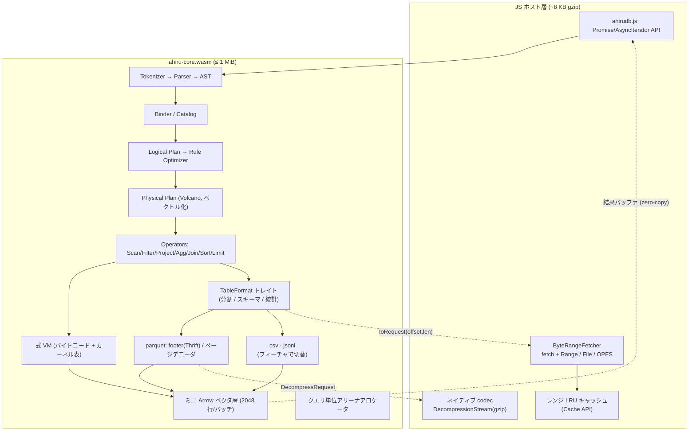

# ahirudb 設計書

WASM 1MB 以内で動く、Parquet を直接クエリできる軽量 SQL エンジン。

---

## 1. 目的と前提

### ゴール

| # | 要件 | 目標値 |
|---|------|--------|
| G1 | WASM バイナリサイズ | **raw ≤ 1 MiB**（gzip ≈ 300–350 KB） |
| G2 | Parquet をテーブルとして読める | ローカル / HTTP Range / OPFS |
| G3 | SQL でクエリできる | SELECT 系のサブセット（§7） |
| G4 | 他フォーマットへ拡張できる | CSV / TSV / JSONL（フィーチャで切替、§5） |

### 前提（明示的な仮定）

- **1MB は raw `.wasm` 単体**とする。ランタイムで後から取得する任意モジュール（`ahiru-zstd`。`zstd` フィーチャを外した opt-out 構成でのみ使う）は別勘定。ZSTD は実測 13 KB 程度と分かったため、既定では別モジュールにせずコア本体（1MB 予算の内側）に含めている（§6）。
- 主ターゲットは**ブラウザ**。Node / Deno / Cloudflare Workers でも同一バイナリが動くこと。
- **読み取り専用**。INSERT / UPDATE / DELETE / トランザクションは対象外。
- 単一スレッド。SharedArrayBuffer（COOP/COEP）に依存しない。
- データ本体はメモリに全部載せない。**必要なカラム・必要なページだけ取得する**のが前提。

### 非ゴール

書き込み、永続カタログ、ウィンドウ関数（v1）、ネスト型のフル対応（v1）、分散実行。

### なぜ既存品ではないのか

| 候補 | サイズ | 判定 |
|------|--------|------|
| duckdb-wasm | 数十 MB（brotli 後でも約 10 MB） | サイズ要件と 1〜2 桁違う |
| sql.js (SQLite) | 約 1.5 MB、Parquet 非対応・行指向 | 要件 G2 を満たさない |
| hyparquet (JS) | 小さいが Parquet リーダのみ、SQL なし | G3 を満たさない |
| Arquero / DataFusion-wasm | SQL なし / 数 MB 超 | 不可 |

→ **専用エンジンを自作する**。1MB という制約は「DuckDB を小さくする」のではなく「最初から入れる機能を選ぶ」ことで達成する。

---

## 2. 全体アーキテクチャ



設計の核は 3 点。

1. **必要なバイトしか読まない**（射影プッシュダウン + 統計プルーニング）。エンジンが小さくてもデータは大きい、を成立させる。
2. **非同期 IO を Asyncify なしで扱う**（§6）。Asyncify は生成コードが 1.5〜2 倍に膨らむのでサイズ要件と両立しない。
3. **ホストでできることはホストでやる**（gzip 展開、レンジキャッシュ、エラーメッセージ整形）。WASM の予算をエンジン本体に集中させる。

---

## 3. サイズ予算

### 実測値（2026-08-11 時点）

> この表は初期実装（Parquet コアのみ）時点のスナップショット。以降 SQL 機能
> （集約・ウィンドウ・CTE・JSON 型・DDL/DML 等）と ZSTD の内蔵化を大量に
> 追加しており、現在の実測値は README.md の "Current size" と
> `./scripts/size.sh` を参照。

`./scripts/size.sh` の出力。`wasm-opt` は未適用。

| 構成 | raw | gzip -9 | 予算比 |
|---|---:|---:|---:|
| parquet のみ（既定の配布構成） | 224.5 KiB | 93.5 KiB | 21.9% |
| parquet + csv + jsonl | **250.2 KiB** | 104.4 KiB | **24.4%** |
| `ahiru-zstd.wasm`（別モジュール） | 17.8 KiB | 8.3 KiB | 予算外 |

見積り 750 KB に対して大きく下振れしている。主因は `no_std` による `core::fmt`
の排除、Thrift を汎用ランタイムではなく手書きデコーダにしたこと、そして
§11 のカーネル削減が実際に効いたこと（式 VM は見積り 150 KB のところ実測で
その 2 割程度に収まった）。`wasm-opt -Oz` を通せばさらに 20〜30% 縮む見込み。

集約・ソート・結合・CSV・JSONL がすべて入った状態でこの数字である。

**この余裕は使い切らずに残す。** 未実装分（スカラ関数、ウィンドウ関数、
スピル）が入る余地であり、§11 のカーネル爆発が現実になったときの吸収先でもある。

### 当初見積り

raw wasm（`wasm-opt -Oz` 後）の見積り。CI でこの表を実測値としてゲートする。

| 領域 | 予算 | 備考 |
|------|-----:|------|
| ランタイム / アロケータ / パニック処理 | 8 KB | `no_std` + 自前アリーナ |
| Thrift Compact + Parquet メタデータ | 45 KB | 手書きデコーダ、必要フィールドのみ |
| Parquet ページデコーダ（各種 encoding） | 70 KB | PLAIN / RLE / DICT / DELTA 系 |
| 圧縮コーデック（snappy, lz4_raw） | 12 KB | gzip はホスト委譲、zstd は別モジュール |
| ベクタ層（ミニ Arrow） | 30 KB | |
| 型システム / キャスト / 日時 | 60 KB | 物理型 6 種に正規化（§8） |
| Tokenizer + Parser | 85 KB | Pratt パーサ |
| Binder / Catalog | 35 KB | |
| Logical Plan + 最適化ルール | 55 KB | |
| 式 VM + カーネル表 | 150 KB | **最大のリスク領域**（§11） |
| ハッシュ集約 | 45 KB | |
| ハッシュ結合 | 40 KB | |
| ソート / Top-N | 30 KB | |
| スカラ関数ライブラリ | 70 KB | 文字列 / 数値 / 日時 |
| 結果シリアライズ | 15 KB | |
| **合計** | **750 KB** | **予備 274 KB (26%)** |

予備を 25% 以上残すのは、実装中の見積り超過を吸収するため。予備が 10% を切ったらフィーチャーを削る判断をする（削減候補は §14）。

---

## 4. 言語とビルド構成

**Rust + `no_std` + `alloc`** を採用する。

理由: Parquet/SQL のような「入力が敵対的になりうるパーサ」を安全に書けること、テストとファジングの資産があることが、C/Zig のわずかなサイズ優位を上回る。ただし Rust の標準的な書き方はサイズ的に致命的なので、以下を強制する。

```toml
# Cargo.toml
[profile.release]
opt-level = "z"
lto = "fat"
codegen-units = 1
panic = "abort"
strip = true

[profile.release.package."*"]
opt-level = "z"
```

```
# .cargo/config.toml
[build]
target = "wasm32-unknown-unknown"
rustflags = ["-Zlocation-detail=none", "-Zfmt-debug=none"]

[unstable]
build-std = ["core", "alloc", "panic_abort"]
build-std-features = ["panic_immediate_abort"]
```

**`no_std` を採る最大の理由は `core::fmt` を排除するため。** `format!` / `Debug` / `Display` を一箇所でも使うとフォーマット機構がリンクされ、それだけで 30–60 KB 消える。エラーは数値コードで持ち、文字列化は JS 側の表で行う（§10）。

`std::collections::HashMap`（SipHash + 大きな実装）も使わない。どのみち集約用に自前のオープンアドレッシング表を書くので、それを唯一のハッシュ表とする。

ビルド後段: `wasm-opt -Oz --strip-debug --strip-producers --enable-bulk-memory`。

**依存クレートは原則ゼロ。** 外部クレートを入れるときは「追加バイト数の実測」を PR に添付する規約にする。

### アロケータ

`dlmalloc`（既定、約 10 KB）ではなく**クエリ単位アリーナ**を自作する（約 2 KB）。

- 割り当てはバンプポインタ、解放はクエリ終了時に一括。中間バッファの大半はクエリ寿命なのでこれで足りる。
- 例外はメタデータキャッシュとハッシュ表のリサイズ。前者は専用の長寿命アリーナ、後者はサイズクラス付きフリーリスト（別途 1 KB）で扱う。
- 副次効果として、メモリ断片化とデストラクタ処理が消えるので実行も速くなる。

---

## 5. データ入力層

### フォーマット抽象化

実行エンジンは `TableFormat` トレイト越しにしかデータ源を見ない。Parquet 固有の
概念（RowGroup、列チャンク、Thrift 統計）は `format::parquet` の内側に閉じる。

```rust
pub trait TableFormat {
    fn resolve(&mut self, src: &Source) -> Result<ResolveStep>;
    fn schema(&self) -> &[Field];
    fn num_splits(&self) -> usize;
    fn split_ranges(&self, split: usize, projection: &[usize], out: &mut Vec<(u64, u64)>) -> Result<()>;
    fn may_match(&self, split: usize, pruners: &[Pruner], projection: &[usize]) -> bool { true }
    fn read_split(&self, src: &Source, split: usize, projection: &[usize]) -> Result<Vec<Vector>>;
}
```

**鍵は「分割 (split)」という 1 つの概念に集約すること。**

| フォーマット | 分割の実体 | 統計 | 射影で減るバイト |
|---|---|---|---|
| Parquet | RowGroup | あり | 減る（列チャンク単位で取る） |
| CSV / TSV | 固定長バイトチャンク | なし | 減らない（行指向なので全部読む） |
| JSONL | 固定長バイトチャンク | なし | 減らない |

§6 の「RowGroup 境界 I/O バリア」は、正確には**分割境界**バリアだった。分割の
開始時点で必要なバイト範囲が確定することだけが要件で、Parquet であることは
要件ではない。だから CSV でも同じ実行ループがそのまま使える。

**射影が 2 段階に分かれる理由**: `split_ranges` に射影を渡すのは、列指向
フォーマットが取得するバイト自体を減らせるため。行指向フォーマットは射影を
渡されても全バイトを読むしかないが、`read_split` 側で不要な列の変換を省ける。
この 2 段階を 1 つの引数で表現しておくと、呼び出し側はフォーマットの性質を
知らずに済む。

同様に、統計プルーニングは `may_match` の既定実装（常に `true`）によって、
統計を持たないフォーマットが何も実装せずに済むようになっている。

### フォーマットの選択とサイズ

`FormatKind::Auto` は名前（ファイル名・URL）の拡張子から推定する。URL の
クエリ文字列とフラグメントは落としてから見る。判定できない場合は Parquet と
みなす。

**追加フォーマットは Cargo フィーチャで切る**（`csv` / `jsonl`）。Parquet だけの
配布物を最小に保つため。`scripts/size.sh` は構成ごとの実測値を並べて出すので、
「CSV を足すと何 KB 増えるか」が毎回可視化される。フィーチャゲートを形骸化
させないための仕掛けであり、サイズゲート自体は**全部入りの構成**で判定する。
配布構成を絞れば通る、では守れていない。

### Parquet 対応範囲（v1）

| 項目 | 対応 |
|------|------|
| フォーマット | Parquet v1 / v2 データページ |
| Encoding | PLAIN, RLE, RLE_DICTIONARY, PLAIN_DICTIONARY, DELTA_BINARY_PACKED, DELTA_LENGTH_BYTE_ARRAY, DELTA_BYTE_ARRAY |
| 圧縮 | UNCOMPRESSED, SNAPPY, LZ4_RAW（内蔵） / GZIP（ホスト委譲） / ZSTD（別モジュール） |
| 型 | BOOLEAN, INT32, INT64, FLOAT, DOUBLE, BYTE_ARRAY, FIXED_LEN_BYTE_ARRAY, INT96(timestamp 互換) |
| 論理型 | STRING, DATE, TIME, TIMESTAMP, DECIMAL, UUID, 整数幅/符号 |
| ネスト | v1 は非対応（LIST/MAP/STRUCT はエラー）。§14 参照 |
| プルーニング | ColumnChunk 統計, PageIndex(Column/Offset Index), Bloom Filter |
| 暗号化 | 非対応 |

`BYTE_STREAM_SPLIT` は使用頻度が低いため v2 送り。

### 読み取りシーケンス

```
1. 末尾 64 KB を投機取得 → magic "PAR1" + footer 長を確認
   （多くのファイルはこれで footer が 1 往復で取り切れる。足りなければ 2 回目）
2. FileMetaData を Thrift Compact でデコード → スキーマ / RowGroup / 統計をキャッシュ
3. バインド時: SQL の参照カラムのみに射影を絞る
4. プランニング時: WHERE から抽出した範囲述語で RowGroup をプルーニング
5. 実行時: RowGroup ごとに
     a. PageIndex があればページ単位でさらにプルーニング
     b. 残ったページの [offset, len) を IoRequest としてまとめて発行
     c. バイト到着後、同期的にデコードしてベクタを生成
```

Thrift デコーダは汎用実装を書かない。**必要なフィールド ID だけを読み、未知フィールドはスキップする専用パーサ**を構造体ごとに手書きする。汎用 Thrift ランタイム + IDL 生成コードは 100 KB 級になるが、この方式なら 45 KB に収まる。

### セキュリティ

Parquet ファイルはネットワーク由来 = 信用できない入力として扱う。

- 全オフセット / 長さは使用前に境界検査。`unsafe` はデコーダに置かない。
- 辞書サイズ、ページ数、スキーマ深さ、行数に上限を設ける（メモリ爆撃対策）。
- Thrift パーサとページデコーダは `cargo-fuzz` の常設ターゲットにする。

---

## 6. 非同期 IO プロトコル（設計上の要）

WASM から JS の `fetch` をブロッキング待ちすることはできない。取りうる選択肢と評価:

| 方式 | サイズ影響 | 判定 |
|------|-----------|------|
| Asyncify (`wasm-opt --asyncify`) | コードが 1.5〜2 倍 | **不可**（1MB 予算が壊れる） |
| SharedArrayBuffer + `Atomics.wait` | ほぼゼロ | COOP/COEP 必須で採用環境を選ぶ → 任意の高速化として残す |
| 全オペレータを `Poll` 対応の状態機械にする | 中（各オペレータが複雑化） | 保守コストが高い |
| **RowGroup 境界の IO バリア** | ほぼゼロ | **採用** |

### 採用方式: 分割境界バリア

実行を「分割 (split) 単位のステップ」に分割し、**各ステップの開始時点で必要な
バイト範囲が確定できる**という性質を使う。ステップ内部は完全に同期実行できる
ので、オペレータは非同期を一切意識しない。

分割は Parquet では RowGroup、CSV / JSONL では固定長バイトチャンクになる（§5）。
この性質さえ満たせば、どのフォーマットでも同じ実行ループに載る。

```c
// エクスポートする ABI（抜粋）
i32  ahiru_query_start(ptr sql, i32 len);            // -> handle
i32  ahiru_query_step(i32 handle);                   // -> Status
ptr  ahiru_io_requests(i32 handle, ptr out_count);   // -> [{source, offset, len}]
void ahiru_io_fulfill(i32 handle, i32 idx, ptr buf, i32 len);
ptr  ahiru_result(i32 handle, ptr out_len);          // 結果バッファ
i32  ahiru_last_error(i32 handle);                   // エラーコード
void ahiru_query_close(i32 handle);

// Status: 0 = BATCH_READY, 1 = NEED_IO, 2 = DONE, 3 = ERROR
```

ホスト側のループ:

```js
for (;;) {
  const st = w.ahiru_query_step(h);
  if (st === NEED_IO) { await fetchAll(w.ahiru_io_requests(h)); continue; }
  if (st === BATCH_READY) { yield decodeBatch(w.ahiru_result(h)); continue; }
  break;
}
```

利点:

- 1 回の `NEED_IO` で**その RowGroup 分の全レンジをまとめて返す**ので、JS 側で並列 fetch・隣接レンジのマージ（gap < 1 MB なら結合）ができる。往復回数が減り、実測スループットは Asyncify 方式より良くなる見込み。
- WASM 側に非同期の概念が入らないので、コードもサイズも増えない。

制約: 遅延マテリアライゼーション（結合結果に応じて後からカラムを取りに行く）はこのモデルでは 1 ステップ余分になる。v1 では採用せず、必要カラムは RowGroup 開始時に全部取る。

### コーデック委譲プロトコル

> **更新（2026-08-11 以降）**: ZSTD は実測 13 KB 程度（予算比 1.3%）に収まる
> ことが分かったため、別モジュールに分ける手間に見合わないと判断し、
> `ahiru-core` に `zstd` フィーチャ（既定で有効）としてライブラリ直接リンク
> する形に変えた。以下の「内蔵しないコーデック」の説明は GZIP のみに適用
> される（ZSTD は `zstd` フィーチャを明示的に外したときだけこの経路を通る）。
> 別モジュールとしての `ahiru-zstd` 自体はそのオプトアウト時の代替として
> 引き続きビルドできる（`crates/ahiru-zstd/Cargo.toml` の `standalone`
> フィーチャ、`scripts/size.sh` 参照）。

内蔵しないコーデック（既定では GZIP のみ。`zstd` を外した場合は ZSTD も）は、
I/O と同じ「止めて要求する」形でホストに委譲する。`ahiru_query_step` が
`STATUS_NEED_CODEC` を返し、`{table, codec, offset, len, out_len}` の列を
渡す。ホストは展開して `ahiru_provide_codec` で返し、ループを続ける。

**成立の鍵は、必要な展開作業が分割の開始時点で確定すること。** ページヘッダは
圧縮されないので、バイトさえ揃えばページ境界を全部走査できる（`collect_codec_pages`）。
だから復号の途中で止まる必要がなく、オペレータは非同期を一切意識しない。

ABI は 3 つだけ:

```c
// ahiru_query_step の戻り値
#define STATUS_NEED_CODEC 4
// 要求列: [count:u32] then [table:u32][codec:u32][offset:u64][len:u32][out_len:u32]
i32 ahiru_provide_codec(i32 h, u32 table, u64 offset, u32 len, ptr data, usize data_len);
```

**圧縮バイトは直前の `NEED_IO` で既に届いている**ので、ホストは再取得しない。
`offset`/`len` は要求と完全一致させる（キャッシュのキーでもある）。

既定構成でホスト委譲が要るのは GZIP だけ、というのが今の要点
（ホスト側だけが違いを知っている、という設計自体は変わらない）:

| コーデック | ホスト側の処理 | wasm コアの追加バイト |
|---|---|---|
| SNAPPY / LZ4_RAW | （内蔵） | 12 KB |
| ZSTD | （内蔵、`zstd` フィーチャ） | 約 13 KB |
| GZIP | `DecompressionStream('gzip')` | **0** |

`zstd` を明示的に外した構成では ZSTD もホスト委譲に戻り、上の「別モジュール」
の表と同じ経路（`ahiru-zstd.wasm` の遅延ロード）を使う。

### キャッシュ

- レンジ LRU キャッシュは **JS 側**に置く。Cache API / IndexedDB を使えるうえ、WASM のバイトを消費しない。
- GZIP は `DecompressionStream('gzip')` に委譲（追加 0 バイト）。ブラウザ/Node に
  既にあるものをコアに重複して持つ理由が無いため、これだけは意図的にホスト委譲のまま。
- ZSTD は既定でコアに内蔵する（`zstd` フィーチャ、約 13 KB）。`zstd` を外せば
  `ahiru-zstd.wasm`（別モジュール、初回必要時のみ動的ロード）への委譲に戻る。
- SNAPPY と LZ4_RAW はデコーダ実装が小さく（合計 12 KB）呼び出し頻度が高いので内蔵する。

---

## 7. SQL 対応範囲

サイズはほぼ文法の広さで決まるので、対応範囲を明示的に切る。

### v1（1MB 予算内）

```sql
SELECT [DISTINCT] <expr> [AS alias], ...
FROM <table | parquet('url') | (subquery)> [alias]
  [ [INNER|LEFT|RIGHT|FULL] JOIN <rel> ON <expr> ]
[WHERE <expr>]
[GROUP BY <expr>, ...] [HAVING <expr>]
[ORDER BY <expr> [ASC|DESC] [NULLS FIRST|LAST], ...]
[LIMIT n] [OFFSET n]
```

- 式: 算術, 比較, `AND/OR/NOT`, `IS [NOT] NULL`, `IN (list)`, `BETWEEN`, `LIKE`, `CASE WHEN`, `CAST`, `COALESCE`, 括弧
- 集約: `COUNT(*|expr)`, `COUNT(DISTINCT)`, `SUM`, `AVG`, `MIN`, `MAX`
- スカラ関数: 文字列（`length/substr/upper/lower/trim/replace/concat/split_part/starts_with`）、数値（`abs/round/floor/ceil/sqrt/pow/mod`）、日時（`date_trunc/date_part/extract/now/strftime`）、`nullif/greatest/least`
- DDL/ユーティリティ: `CREATE VIEW`(メモリ内), `DESCRIBE`, `SHOW TABLES`, `EXPLAIN`

### v2 以降（フィーチャーフラグ、別バイナリ）

CTE (`WITH`)、相関/非相関サブクエリ、`UNION/INTERSECT/EXCEPT`、ウィンドウ関数、`GROUPING SETS`、`ARRAY`/ネスト型アクセス。

v2 機能は `ahiru-full.wasm`（目標 1.6 MB）として別ビルドし、コア 1MB の約束を壊さない。

### パーサ

- Tokenizer: 手書き。キーワードは perfect hash（`phf` 相当のテーブルを build.rs で生成）で引く。
- Parser: 式は Pratt（優先順位登り）、文は再帰下降。**再帰深度に上限を設ける**（スタック枯渇によるトラップ回避）。
- AST はアリーナ上のインデックス参照（`u32` ID）で持つ。`Box`/`Rc` を使わない → アロケーション削減とサイズ削減の両方に効く。

---

## 8. 型システム

**論理型と物理型を分離し、物理型を 6 種に絞る**のが、カーネル爆発（§11）を抑える鍵。

| 論理型 | 物理表現 |
|--------|----------|
| BOOLEAN | `Bool`（ビットマップ） |
| TINYINT / SMALLINT / INTEGER / DATE / TIME | `I32` |
| BIGINT / TIMESTAMP / DECIMAL(p≤18) | `I64` |
| FLOAT / DOUBLE | `F64` |
| VARCHAR / BLOB | `Bytes`（offset + data の 2 バッファ） |
| DECIMAL(p>18) / UUID / HUGEINT | `I128` |

- 実行カーネルは**物理型 6 種に対してのみ**書く。論理型はスケール/表示のためのメタデータとして持ち回る。
- 例: `DATE < DATE` は `I32 < I32` のカーネル 1 本で処理し、比較の意味付けは binder が済ませておく。
- 符号なし整数は 1 段上の符号付き型に昇格（UINT32 → I64）。UINT64 のみ I128 に。これでカーネルを倍にせずに済む。
- NULL は Arrow 互換の validity ビットマップ。三値論理は binder が明示的に扱い、カーネルは「値の計算」と「validity の計算」を分離する。

---

## 9. 実行エンジン

### ベクタ層（ミニ Arrow）

- バッチ = 2048 行 × カラム。カラムは `{ validity: Bitmap, data: Buffer, offsets: Option<Buffer> }`。
- **セレクションベクタ**を採用。フィルタは行をコピーせず `u16` のインデックス配列を絞るだけ。低選択率クエリで大きく効く。
- **辞書ベクタ**を保持する。Parquet の RLE_DICTIONARY をデコードせずそのまま持ち回り、`GROUP BY` や等値比較を辞書コード上で行う。文字列カラムの集約が数倍速くなる、v1 の目玉最適化。

### オペレータ（プル型 Volcano）

`Scan / Filter / Project / HashAggregate / HashJoin / Sort / TopN / Limit`

プッシュ型のほうが高速だが、プル型のほうがコード量が小さく、§6 のステップ実行に自然に載るのでプル型を採る。ベクトル化（1 回の `next()` で 2048 行）により、Volcano の呼び出しオーバーヘッドは相対的に無視できる。

- **HashAggregate**: グループキーを固定幅の行レイアウトに正規化 → オープンアドレッシング表（線形探査、2 のべき乗容量）。可変長キーは別アリーナに退避しポインタを持つ。
- **HashJoin**: Parquet メタデータの行数から小さい側をビルド側に選ぶ。ビルド側がメモリ上限を超えたらエラー（v1 ではスピルしない）。
- **Sort**: `ORDER BY ... LIMIT n` は Top-N ヒープ（メモリも時間も O(n)）。全ソートは正規化キーへの変換 + radix sort。
- **メモリ上限**: 既定 512 MB（設定可能）。超過は `ERR_OOM` として明示的に返す。**サイレントに落ちない**ことを保証する。

### 式評価: 小さなベクタ VM

式ツリーを再帰評価する代わりに、**フラットなバイトコードにコンパイル**する。

> **実装時の変更**: 当初は `AND`/`OR`/`CASE` を分岐命令で短絡評価する想定だったが、
> **分岐命令を持たず、両辺を評価して `Select` 命令で合成する**方式に変えた。
> 行ごとの分岐はベクトル化を壊し、命令ポインタの巻き戻しが VM を大きくするため。
> 短絡が必要になる唯一のケースはゼロ除算だが、これは DuckDB と同じく
> **エラーではなく NULL を返す**ことで解消している。`IN` と `BETWEEN` も
> 専用命令を持たず、コンパイル時に `Eq` の `OR` 連鎖 / `Ge` と `Le` の `AND` に
> 展開する（DESIGN.md §11 の「カーネルを増やさない」方針の適用）。

```
instr: { op: u8, ty: u8, dst: u16, a: u16, b: u16 }
```

実行は `kernel_table[op][ty]` の関数ポインタ経由。理由:

- ジェネリクスによる単相化爆発を、テーブル 1 枚に置き換えられる（サイズが線形にしか増えない）。
- 短絡評価（`AND`/`OR`）や `CASE` は分岐命令で表現でき、行ごとの再帰が消える。
- 将来 `EXPLAIN ANALYZE` や JIT 的な最適化を足すときの土台にもなる。

### プラン最適化（ルールベースのみ）

1. 定数畳み込み・自明な述語除去
2. 述語プッシュダウン → **Scan の統計プルーニングに直結**（最重要）
3. 射影プッシュダウン → **取得カラムの削減 = 転送量の削減**（同上）
4. `LIMIT` プッシュダウン（ソート → TopN 変換含む）
5. 結合順序: Parquet メタデータの行数のみを使う単純な貪欲法

コストベース最適化は入れない。統計は RowGroup 単位の min/max/null_count で十分な効果が出る。

---

## 10. JS API

```ts
import { AhiruDB } from "ahirudb";

const db = await AhiruDB.init({
  wasmUrl: "/ahiru-core.wasm",
  memoryLimit: 512 * 1024 * 1024,
  cache: "cache-api",          // "memory" | "cache-api" | "none"
});

// 登録は非同期 IO を伴わない（footer は初回クエリ時に遅延取得）
db.registerParquet("trips", "https://example.com/trips.parquet");
db.registerParquet("local", fileHandleOrFile);

// 1) 全件取得
const rows = await db.query("SELECT vendor, count(*) c FROM trips GROUP BY 1 ORDER BY c DESC");

// 2) ストリーミング（大きい結果向け）
for await (const batch of db.stream("SELECT * FROM trips WHERE fare > 100")) {
  // batch.numRows, batch.column("fare") -> Float64Array（コピーなし view）
}

// 3) パラメータバインド（文字列連結を避ける）
await db.query("SELECT * FROM trips WHERE vendor = ?", ["VTS"]);

// FROM に URL を直接書く形も許可
await db.query("SELECT * FROM parquet('https://example.com/a.parquet') LIMIT 10");
```

- 結果は **Arrow IPC 互換のバッファ**として返す。Arrow JS を使うユーザはゼロコピーで受け取れ、使わないユーザ向けには軽量なアクセサを同梱する。
- エラーは WASM から数値コード + 位置情報（バイトオフセット）で返し、**メッセージ文字列は JS 側のテーブルで生成**する。この分担だけで WASM から約 20 KB のメッセージ文字列を排除できる。
- 型定義（`.d.ts`）を配布物に含める。

---

## 11. サイズ最適化の具体策

最大のリスクは **カーネル爆発**。素朴に書くと、`(演算子 20) × (物理型 6) × (入力の組合せ: vec-vec / vec-const / selection 有無 4)` = 480 個の単相化関数が生まれ、これだけで 300 KB を超える。対策:

1. **物理型を 6 種に正規化する**（§8）。論理型ごとのカーネルは作らない。
2. **selection ベクタを分岐で扱う**。`selection: Option<&[u16]>` を型パラメータにせず実行時分岐にする。ホットループの外の分岐なので性能影響は小さく、コードは 1/2 になる。
3. **定数側の畳み込み**。`vec op const` は const を長さ 1 のベクタとして扱い、専用カーネルを持たない（差が出るケースのみ後から個別最適化）。
4. **比較演算子は 1 カーネルに畳む**。`<, <=, >, >=, =, <>` を「3 値比較結果 + 結果マスク」の形にまとめ、6 本を 1 本にする。
5. **算術のマクロ生成を禁止しない代わりに実測する**。`macro_rules!` は便利だがサイズを見えなくするので、生成後の関数サイズを CI で追う。

### CI ゲート

```yaml
# 疑似
- run: cargo build --release && wasm-opt -Oz -o out.wasm
- run: test $(stat -f%z out.wasm) -le 1048576   # ハードリミット
- run: twiggy top -n 40 out.wasm > size-report.txt
- run: twiggy diff base.wasm out.wasm           # PR コメントに差分を貼る
```

**サイズ回帰は PR で必ず可視化する。** 1MB は「最後に測る目標」ではなく「毎 PR で守る制約」として扱う。1 PR あたり +5 KB を超えたら理由を PR 本文に書く規約にする。

---

## 12. リポジトリ構成

```
ahirudb/
├── crates/
│   ├── ahiru-core/       # no_std。エンジン本体（下記モジュール）
│   │   ├── alloc/        # アリーナ
│   │   ├── vector/       # ミニ Arrow
│   │   ├── parquet/      # thrift, metadata, page, encoding, codec
│   │   ├── sql/          # tokenizer, parser, ast
│   │   ├── plan/         # binder, catalog, logical, optimizer
│   │   ├── exec/         # operators, hashtable, sort
│   │   ├── expr/         # bytecode VM, kernels
│   │   └── abi/          # wasm export 境界
│   ├── ahiru-zstd/       # ahiru-core に既定でリンクされる（`zstd` フィーチャ）。
│   │                     # opt-out 時のみ別 wasm として単独ビルド可（`standalone`）
│   └── ahiru-cli/        # ネイティブビルド。デバッグ/テスト用
├── js/                   # ahirudb npm パッケージ（ホスト層）
├── tests/
│   ├── slt/              # sqllogictest 形式のクエリ回帰
│   ├── parquet-testing/  # apache/parquet-testing のファイル資産
│   └── fuzz/             # cargo-fuzz ターゲット
└── docs/DESIGN.md
```

`ahiru-cli`（ネイティブ）を先に動かせるようにするのが重要。WASM 越しのデバッグは効率が悪いので、**開発とテストはネイティブ、サイズ計測だけ WASM** という回し方にする。

---

## 13. 実装ロードマップ

| フェーズ | 内容 | 状態 |
|---------|------|------|
| **M0** 骨格 | アリーナ、ベクタ層、ABI、JS ホスト、CI サイズゲート | 完了 |
| **M1** Parquet 読み | Thrift、メタデータ、PLAIN/DICT/RLE/DELTA、snappy/lz4 | 完了 |
| **M2** SQL 最小 | Tokenizer/Parser/Binder、Filter、Project、式 VM | 完了 |
| **M3** プッシュダウン | 統計プルーニング、射影プッシュダウン、レンジ IO | 完了 |
| **M4** 集約 | ハッシュ集約、`ORDER BY`/TopN、`DISTINCT`、`HAVING` | 完了 |
| **M5** 結合 | ハッシュ結合（内/左/右/完全/交差）、非等値のネストループ | 完了 |
| **M6** 仕上げ | DELTA 系 encoding、zstd 別モジュール、GZIP ホスト委譲 | 完了 |
| **M7** 他フォーマット | `TableFormat` 抽象化、CSV / TSV / JSONL | 完了 |
| **M8** 未着手 | スカラ関数、ウィンドウ関数、Arrow IPC 出力、スピル | 未着手 |

各フェーズの終わりに `twiggy` でサイズ実測を記録し、§3 の予算表を更新する。

### ベンチマーク

TPC-H SF1（Parquet）と NYC Taxi の一部を基準にし、**duckdb-wasm との相対性能とサイズ比**を README に載せる。目標は「サイズ 1/30、単純な集約クエリで 2〜4 倍以内の実行時間」。

---

## 14. リスクと対処

| リスク | 影響 | 対処 |
|--------|------|------|
| **カーネル爆発でサイズ超過** | 高 | §11 の 5 対策。予備 274 KB。それでも超えたら削減順序: DELTA encoding → I128 → 日時関数 → `FULL JOIN` |
| ~~ZSTD が実質必須で別ロードが煩わしい~~ | ~~中~~ | **解決済み（2026-08-11）**: 実測で ZSTD デコーダが約 13 KB（見積り 1.1 MB は大幅な過大見積りだった）と判明したため、同梱版を別配布するのではなく `zstd` フィーチャとして既定でコアに含めることにした（§6）。オプトアウトしたいときだけ別モジュール（`ahiru-zstd`、`standalone` フィーチャ）に切り出せる |
| ネスト型（LIST/STRUCT）非対応 | 中 | v1 は明示エラー。実データでは頻出するので v2 の最優先候補。repetition/definition level のデコーダは約 25 KB の見込み |
| Rust の `no_std` 縛りが開発速度を落とす | 中 | ネイティブビルド（`ahiru-cli`）では `std` を許可し、`#[cfg]` で切り替え。テストは std 側で書く |
| メモリ上限超過（大きな結合・集約） | 中 | スピルは実装しない。上限超過を明示エラーで返し、ドキュメントに限界を書く |
| 敵対的 Parquet によるクラッシュ | 中 | 常設ファジング + 全境界検査 + 各種上限（§5） |
| Rust nightly（`build-std`）依存 | 低 | toolchain を固定。安定化されれば移行 |

---

## 15. 現状の制限（既知・意図的）

黙って壊れるより、対応していないと言う方がよい。以下は実装済みの範囲で
意図的に残している制限で、いずれもエラーコードか文書で明示される。

| 項目 | 内容 | 影響 |
|---|---|---|
| スピルしない | 集約・結合・ソートはメモリ内で完結する。上限超過は `Oom` を返す | 巨大な GROUP BY / 結合が失敗する。サイレントに落ちることはない |
| 結合のビルド側 | 構文上の右側を常にビルド側にする。行数によるサイド選択をしていない | 左が小さい結合で無駄にメモリを使う。結果は正しい |
| ネスト型 | LIST / MAP / STRUCT は `UnsupportedNested` | Spark 由来のファイルの一部が読めない |
| CSV の分割 | 引用符内の改行が分割境界の直後に来ると再同期を誤りうる | 並列 CSV リーダ共通の妥協。単一分割にすれば回避できる |
| スカラ関数 | `length` / `upper` などは未実装（`FunctionNotFound`） | 文字列操作が書けない |
| サブクエリ | FROM 句の派生表のみ。相関・スカラサブクエリは未対応 | |
| ウィンドウ関数 | 未対応 | |
| `LZO` / `BROTLI` | 未対応（`UnsupportedCodec`） | ホスト委譲の枠組みには乗るので、追加は JS 側だけで済む |

### 浮動小数と丸めの取り決め

DuckDB に合わせてある。両者で挙動が割れやすいので明示しておく。

- 浮動小数 → 整数のキャストは**最近接偶数への丸め**（`1.5 → 2`、`4.5 → 4`）。
- DECIMAL のスケール縮小は **0 から遠ざかる丸め**（`1.235 → 1.24`）。
  金額計算で系統的に過小評価にならないようにするため。
- 整数のゼロ除算と `MIN / -1` は**エラーではなく NULL**。浮動小数は IEEE のまま。
- 整数の算術オーバーフローは wrapping。`SUM` だけは i128 で受けて、
  溢れたら `ValueOutOfRange` を返す。
- グループ化と結合キーでは `-0.0` と `0.0` は同一視し、NaN は 1 つにまとめる。
  一方、比較演算では NaN は常に偽（`<>` のみ真）。

---

## 16. 更新系（DDL/DML）の設計 — オプトアウト可能

読み取り専用のコアとは独立に、書き出し・DDL・DML を Cargo フィーチャで
段階的に足せるようにしてある。**既定ではすべて無効**で、フィーチャを
外せば該当コードごと wasm から消える。「全部入りで動くものをフラグで
削る」のではなく、「最初から無いものをフラグで足す」設計にしてあるのが
このエンジン全体の方針（DESIGN.md 冒頭）と同じ理由による。

| フィーチャ | 内容 | 状態 |
|---|---|---|
| `export` | `TableSink` トレイト、CSV/JSONL 書き出し | 実装済み |
| `export-parquet` | 同、Parquet 出力（Thrift シリアライザが要る） | 未実装 |
| `ddl` | `CREATE TABLE` / `CREATE TABLE AS` / `DROP TABLE` / `CREATE VIEW` / `DROP VIEW`（メモリ上のみ） | 実装済み |
| `dml` | `INSERT` / `UPDATE` / `DELETE`（`ddl` を暗黙に含む） | 実装済み |

### なぜ 4 つに割るのか

一枚岩の「write フィーチャ」にすると、安く切れる部分と切れない部分が
混ざる。特に **`dml` だけは他の 3 つと性質が違う**。

`export`/`ddl` は「読み取り結果をどう外に出すか」の話で、読み取り側の
不変条件（`Source` は一度入ったバイトが書き換わらない、分割境界でしか
I/O を待たない）に一切触れずに実装できる。実際 `export` はセッションの
既存の公開 API（`prepare`/`step`）を外側から叩くだけの新規モジュール
（`src/write/`）として実装しており、`catalog.rs` や `format::TableFormat`
には指 1 本触れていない。

一方 `dml`（特に `UPDATE`/`DELETE`）は「読み取ったデータを書き換える」話
で、`Source` の不変性そのものと衝突する。これを筋よく実現する唯一の道は、
**Parquet ファイルの読み取り経路とは完全に別系統の、可変なインメモリ
テーブル**を新設し、DML はそちらにしか効かないと明確に線を引くこと。
`CREATE TABLE t (...)` で作った表はこのインメモリ表になり、
`parquet('...')` で参照した表は今まで通り読み取り専用のまま、という
棲み分けにした（実装済み。以下）。

### `export` の実装（`src/write/`）

```rust
pub trait TableSink {
    fn begin(&mut self, schema: &[Field]) -> Result<()>;
    fn write_batch(&mut self, schema: &[Field], batch: &Batch) -> Result<()>;
    fn finish(&mut self) -> Result<Vec<u8>>;
}

pub fn export_all(session: &mut Session, sql: &str, params: &[Value], sink: &mut dyn TableSink) -> Result<Vec<u8>>;
```

読み取り側の `TableFormat`（`Batch` を produce する）と対称に、書き出し側
は `Batch` を consume するだけの薄いトレイトにしてある。`export_all` は
`Session::prepare`/`Session::step` という既存の公開 API を呼ぶだけなので、
`export` フィーチャを丸ごと外しても読み取り側のコードは 1 行も変わらない
（= オプトアウトが安全である根拠）。

**v1 の制限**: `export_all` は非再開設計。実行中に `NEED_IO`/`NEED_CODEC`
が発生すると `IoFailed` で失敗する。全データがメモリ上にある場合（CLI
利用、または JS 側が事前にテーブルを完全に取得済みの場合）にしか使えない。
読み取りエンジンの中核である「バイトが足りなければ止めて要求を返す」設計
（§6）と同じ形の再開可能な書き出し ABI は、`ahiru_query_step` と対になる
`ahiru_export_step` のようなものが要るため、フォローアップとする。

**未配線**: SQL の `COPY (SELECT ...) TO 'x.csv'` 構文、および wasm ABI
からの呼び出し口（`ahiru_export_csv` 相当）。前者は `sql::ast::Stmt` に
新しいバリアントを足して `Session::prepare` のディスパッチに 1 行足すだけ
で済むはずだが、`catalog.rs`/`session.rs` が別の変更（複数ファイル対応）
と同時に進行中だったため、今回は Rust API（`write::export_all` を直接
呼ぶ）までの実装に留めた。

### `ddl`/`dml` の実装

**インメモリテーブル（`catalog::MemTable`）**: `Catalog` に、ファイル由来の
`Vec<Table>` とは完全に独立した `Vec<MemTable>`（`#[cfg(feature = "ddl")]`）
を追加した。`MemTable` は行指向（`rows: Vec<Vec<Value>>`）— DML が行単位の
更新・削除中心であることを優先し、列指向にはしていない（このエンジンの
最適化の主戦場である「大きな Parquet を速く読む」話には効かない領域なので、
単純さを優先した）。名前解決は `Catalog::index_of`（ファイル）とは別枠の
`mem_index_of`/`view_index_of` を新設し、既存の `Table`/`TablePart`/`Source`
の型・意味は 1 行も変えていない。

**ビュー**は AST ではなく `(名前, クエリ本体の生 SQL)` として `Catalog` に
保持する。参照されるたびに `plan::bind::flatten_from` が再パース・再束縛
する設計で、`ExprArena`/`QueryStmt` を `Catalog` に持たせずに済む（`catalog`
を `sql::ast` に依存させたくないため）。無限再帰（ビューが自分自身や別の
ビューを再帰的に参照するケース）は `CteScope::view_depth` カウンタで
`MAX_VIEW_DEPTH` に頭打ちにしてある。

**Scan との統合**: `plan::Node` に `MemScan`、`exec` に対応する `MemScan`
オペレータを追加した。`Scan`（Parquet/CSV/JSONL 用）とは別のオペレータに
分けたのは、`MemScan` が原理的に `NeedIo`/`NeedCodec` を返さないことを型で
保証したかったため — `MemTable` は既にメモリ上にあるので、分割境界バリア
（§6）は端から必要ない。`FROM memtable` は、CTE・派生表と同じ「`Rel` に
`subplan: Some(Node::MemScan(..))` を持たせる」仕組みにそのまま乗せてあり、
`plan::bind` の SELECT 側の構造（`flatten_from`/`push_table_rel` 等）は
新しい分岐を足しただけで、既存の処理は変えていない。

**DDL/DML の実行**: `CREATE TABLE`/`DROP TABLE`/`CREATE VIEW`/`DROP VIEW`/
`INSERT`/`UPDATE`/`DELETE` はいずれも副作用を伴う一発実行の文であり、
Volcano のストリーミング実行（`Session::step`）には乗らない。`Session::prepare`
の中で完結させ、影響行数を 1 行 1 列（`count`）の `Query` として返す
（`SHOW TABLES`/`DESCRIBE` が使う「あらかじめ確定した 1 バッチを返す」
`exec::Values` と同じ手口）。新規モジュール `src/ddl.rs`/`src/dml.rs`
（`export`/`write` と同じくオプトアウト可能な薄いモジュール）にまとめた。

行の値評価（`INSERT ... VALUES` の各値、`UPDATE ... SET`、`WHERE`）は
専用のスカラ評価器を書かず、既存のバイトコード VM（`expr::vm::Vm`）を
そのまま使う。`MemTable::batch` で行を最大 `BATCH_SIZE` 行の `Batch` に
変換し、`Vm::eval`/`eval_filter` に通す — 型変換（`plan::compile::cast_program`）
・NULL・3 値論理を `SELECT` と完全に同じ規則で扱えるうえ、コードサイズも
増えない。`UPDATE` の `SET` は DuckDB と同じ同時代入セマンティクス（各 SET
式は更新前の行に対して評価する）。

**`CREATE TABLE AS SELECT` / `INSERT ... SELECT` は非再開設計**: `export_all`
と同じ理由・同じ制約。ソースクエリの実行中に `NEED_IO`/`NEED_CODEC` が
発生すると `IoFailed` で失敗する。全データがメモリ上にある場合にしか
使えない（`src/ddl.rs::run_query_to_rows` のドキュメント参照）。

**読み取り専用テーブルへの防御**: `INSERT`/`UPDATE`/`DELETE` の対象が
ファイル由来のテーブルだったときは `ReadOnlyTable` エラーで拒否する
（`dml::mem_index_writable`）。`CREATE TABLE`/`CREATE VIEW` がファイル
テーブルと同名の場合も `DuplicateTable` で拒否する。

**テスト**: `crates/ahiru-core/tests/ddl_dml.rs` に、CREATE TABLE → INSERT →
SELECT → UPDATE → SELECT → DELETE → SELECT → DROP TABLE の一連の流れ、
CTAS・INSERT SELECT・CREATE VIEW の組み合わせ、読み取り専用テーブルへの
DML 拒否、`CREATE TABLE`/`IF NOT EXISTS`/`OR REPLACE` の衝突検査を
統合テストとして持たせてある。

---

## 17. 未決事項（要判断）

1. **1MB は raw か gzip か。** 本書は raw ≤ 1 MiB を前提にした。gzip 後 1 MB でよいなら実質 3 MB 相当の予算になり、ウィンドウ関数やネスト型を v1 に入れられる。
2. **実行環境の優先度。** ブラウザ最優先で設計したが、Cloudflare Workers 等のエッジが主戦場なら、起動時間（コンパイルキャッシュ）とレンジ IO の設計を寄せる余地がある。
3. **ネスト型の要否。** 実データが Spark 由来なら LIST/STRUCT はほぼ必須で、v1 スコープを見直す必要がある。
4. **Arrow JS への依存可否。** 結果を Arrow IPC で返す方針だが、Arrow JS 自体が重い（数百 KB）。軽量アクセサだけで足りるなら同梱を薄くできる。

以上について方針が決まれば、§3 の予算表と §7 の SQL 範囲を確定させる。
